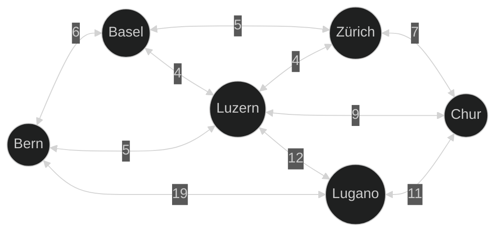
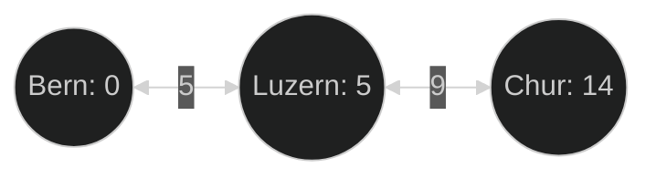

## Einführung

Dijkstra's Algorithmus ermöglicht es den billigsten Weg zwischen Knoten in einem
gewichteten Graphen zu finden. Der Algorithmus ist nach dem niederländischen
Informatiker und Wissenschaftler [Edsger W. Dijkstra][wiki-edsger_w_dijkstra]
benannt, der ihn 1956 entwickelte.  
Er findet den kürzesten Weg von einem Startknoten zu allen anderen Knoten im
Graphen. Dies kann einerseits nützlich sein um den kürzesten Weg von einer
Ausgangsstadt zu einer anderen Stadt zu finden oder in der Netzwerktechnik um
die schnellste Verbindung zu einem anderen Computer zu finden, zum Beispiel als
Teil von OPFS ([Open Shortest Path First][wiki-ospf]).

## Beispiel

Um den Algorithmus einmal graphisch darzustellen und das Verständnis zu
vereinfachen hier ein Beispiel:

Gegeben ist folgender Graph:



Wenn nun das Ziel ist den kürzesten Weg von Bern nach Chur zu finden muss der
Algorithmus herausfinden, wie teuer es ist von Bern zu den anderen Knoten zu
gelangen. Dazu beginnt man mit Bern, welches keine Kosten hat, da man dort
beginnt, von hier aus können alle direkt Verbunden Knoten erreicht werden.
Diese erhalten, dann die bisherigen Kosten plus die Kosten der Kante über welche
sie erreicht werden sowie die Information von welchem Knoten aus sie erreicht
wurden. Alle so neu gefunden Knoten, werden in eine Liste aufgenommen, damit all
deren Verbindungen geprüft werden können. Wird ein Knoten von zwei verschiedenen
Pfaden erreicht, so erhält dieser die Kosten welche tiefer sind. Nachdem alle
Knoten überprüft wurden können die Kosten für den Knoten Chur sowie alle
vorherigen Knoten ausgelesen werden.

In diesem Fall wäre der schnellste Weg von Bern nach Chur über Luzern, dies
führt zu Kosten von 14:



## Funktionsweise

{}
Dieser Abschnitt orientiert sich stark an der Beschreibung von Wikipedia:  
[Dijkstr's Algorithm > Algorithm][wiki-dijkstras_algorithm-algorithm]
{}

Dijkstra's Algorithmus benötigt einen Startknoten sowie einen Zielkonten `N`,
welcher eine Distanz zum Startknoten hat. Der Algorithmus geht dann davon aus
das alle Knoten eine Unendliche Distanz haben und versucht diese zu verbessern.

1. Erstelle ein Set aller Knoten, welche noch nicht geprüft wurden.
2. Weise jedem Knoten eine Distanz von Startknoten hinzu für den Startknoten ist
   diese 0 für alle anderen Unendlich, da noch kein Pfad zu diesen gefunden
   wurde. Während der Ausführung werden diese durch die kürzest gefunden Pfade
   ersetzt.
3. Wähle den Knoten mit der kleinsten endlichen Distanz aus dem Set der
   noch nicht besuchten Knoten, anfänglich wird dies der Startknoten sein.
   Falls das Set leer ist oder kein Knoten mit einer endlichen Distanz gefunden
   wird ist der Algorithmus fertig und es kann mit Schritt 6 fortgefahren
   werden. Falls nur der Pfad zum Zielknoten relevant ist, kann der Algorithmus
   auch zu Schritt 6 springen, wenn der jetzige Knoten der Zielknoten ist.
4. Für den jetzigen Knoten überprüfe alle Nachbarn, welche noch nicht besucht
   wurden und aktualisieren deren Distanz. Dazu muss die neu berechnete Distanz
   durch den jetzigen Knoten mit der momentanen Distanz des Nachbarns verglichen
   werden, dieser soll die kleiner Distanz erhalten. Das heisst wenn der jetzige
   Knoten `A` eine Distanz von 7 hat und die Kante zum Nachbarn `B` eine Länge
   von 2 hat, so ist die Distanz zu `B` über `A` 9 (7 + 2). Ist die momentane
   Distanz von `B` grösser als 9 soll diese auf 9 gesetzt werden (Der Weg über
   `A` ist kürzer), andernfalls soll die Distanz beibehalten werden (Der Weg
   über `A` ist nicht kürzer).
5. Nachdem alle Nachbarn des jetzigen Knoten überprüft wurden, markiere den
   jetzigen Knoten als besucht und entferne ihn aus dem Set der noch nicht
   besuchten Knoten. Dadurch wird dieser nicht mehr überprüft, dies ist korrekt,
   da die gespeicherte Distanz auf dem Knoten bereits minimal ist (durch Schritt
   3 sichergestellt) und deshalb final.  
   Gehe zurück zu Schritt 3.
6. Nachdem die Schleife fertig ist (Schritte 3-5) enthalten alle Knoten die
   kürzeste Distanz vom Startknoten aus.

## Pseudocode

Folgend ist ein Pseudocode Beispiel des Algorithmus dieses Benutzt eine
priorisierte Warteschlange um die Knoten mit der kleinsten Distanz zu erhalten.
Dazu nutzt er eine einfach Optimierung des Algorithmus bei der nicht alle Knoten
mit einer Unendlichen Distanz initialisiert werden, sondern neue Knoten nach und
nach entdeckt werden.

```javascript
function dijkstra(start, graph) {
  PriorityQueue<Tuple<Number, Node>> queue;

  Map<Node, Number> distances;
  Map<Node, Number> previous;

  distances[start] = 0;
  previous[start] = null;

  queue.push(Tuple(0, start));

  while(!queue.empty()) {
    Number distance, Node current = queue.pop();

    for(Node neighbor in graph.neighbors(current)) {
      Number newDistance = distances + graph.distance(current, neighbor);

      if(!distances.contains(neighbor) || newDistance < distances[neighbor]) {
        distances[neighbor] = newDistance;
        previous[neighbor] = current;
        queue.push(Tuple(newDistance, neighbor));
      }
    }
  }

  return dist, prev;
}
```

## Ressourcen

[Wikipedia - Dijkstr's Algorithm][wiki-dijkstras_algorithm]  

## Implementierung




#include <iostream>
#include <map>
#include <queue>
#include <string>
#include <tuple>
#include <vector>

struct Node
{
  std::string name;

  Node(const std::string& name): name(name) {}
};

struct Edge
{
  struct Node *first;
  struct Node *second;
  int distance;

  Edge(struct Node *first, struct Node *second, int distance): first(first), second(second), distance(distance) {}
};

struct Graph
{
  std::vector<struct Node *> nodes;
  std::vector<struct Edge *> edges;

  ~Graph()
  {
    for (auto edge : edges)
      delete edge;
  }

  void addNode(struct Node *node)
  {
    nodes.push_back(node);
  };

  void addEdge(struct Node *first, struct Node *second, int distance)
  {
    struct Edge *edge = new Edge(first, second, distance);
    edges.push_back(edge);
  };

  std::vector<struct Node *> getNeighbors(struct Node *node)
  {
    std::vector<struct Node *> neighbors;

    for (const auto& edge : edges)
    {
      if (edge->first == node)
      {
        neighbors.push_back(edge->second);
      }
      else if (edge->second == node)
      {
        neighbors.push_back(edge->first);
      }
    }

    return neighbors;
  };

  int getDistance(struct Node *first, struct Node *second)
  {
    for (const auto& edge : edges)
    {
      if ((edge->first == first && edge->second == second) || (edge->first == second && edge->second == first))
      {
        return edge->distance;
      }
    }

    throw std::runtime_error("No edge found between nodes");
  };
};

std::tuple<std::map<struct Node *, int>, std::map<struct Node *, struct Node *>> dijkstras(struct Node *start, Graph *graph)
{
  using QueueType = std::tuple<int, struct Node *>;

  std::priority_queue<QueueType, std::vector<QueueType>, std::greater<QueueType>> queue;

  std::map<struct Node *, int> distances;
  std::map<struct Node *, struct Node *> previous;

  distances[start] = 0;
  previous[start] = nullptr;

  queue.push(std::make_tuple(0, start));

  do
  {
    auto [distance, current] = queue.top();
    queue.pop();

    for (const auto& neighbor : graph->getNeighbors(current))
    {
      int newDistance = distance + graph->getDistance(current, neighbor);

      if (!distances.count(neighbor) || newDistance < distances[neighbor])
      {
        distances[neighbor] = newDistance;
        previous[neighbor] = current;
        queue.push(std::make_tuple(newDistance, neighbor));
      }
    }
  } while (!queue.empty());

  return std::make_tuple(distances, previous);
}

int main(int argc, char *argv[])
{
  Node *Bern = new Node("Bern");
  Node *Basel = new Node("Basel");
  Node *Luzern = new Node("Luzern");
  Node *Lugano = new Node("Lugano");
  Node *Zürich = new Node("Zürich");
  Node *Chur = new Node("Chur");

  Graph *graph = new Graph;

  graph->addNode(Bern);
  graph->addNode(Basel);
  graph->addNode(Luzern);
  graph->addNode(Lugano);
  graph->addNode(Zürich);
  graph->addNode(Chur);

  graph->addEdge(Bern, Basel, 6);
  graph->addEdge(Bern, Luzern, 5);
  graph->addEdge(Bern, Lugano, 19);
  graph->addEdge(Basel, Zürich, 5);
  graph->addEdge(Basel, Luzern, 4);
  graph->addEdge(Luzern, Zürich, 4);
  graph->addEdge(Luzern, Chur, 9);
  graph->addEdge(Luzern, Lugano, 12);
  graph->addEdge(Zürich, Chur, 7);
  graph->addEdge(Lugano, Chur, 11);

  auto [distances, previous] = dijkstras(Bern, graph);

  std::cout << "Distance from Bern to Chur: " << distances[Chur] << std::endl;

  delete graph;

  delete Bern;
  delete Basel;
  delete Luzern;
  delete Lugano;
  delete Zürich;
  delete Chur;

  return 0;
}




[wiki-edsger_w_dijkstra]: https://en.wikipedia.org/wiki/Edsger_W._Dijkstra
[wiki-ospf]: https://en.wikipedia.org/wiki/Open_Shortest_Path_First
[wiki-dijkstras_algorithm]: https://en.wikipedia.org/wiki/Dijkstra%27s_algorithm#:~:text=%5B17%5D-,Algorithm,-%5Bedit%5D
[wiki-dijkstras_algorithm-algorithm]: https://en.wikipedia.org/wiki/Dijkstra%27s_algorithm#:~:text=%5B17%5D-,Algorithm,-%5Bedit%5D
