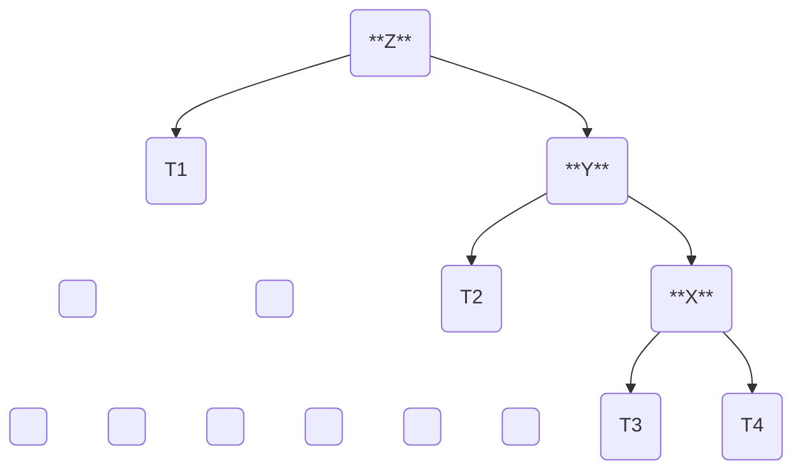
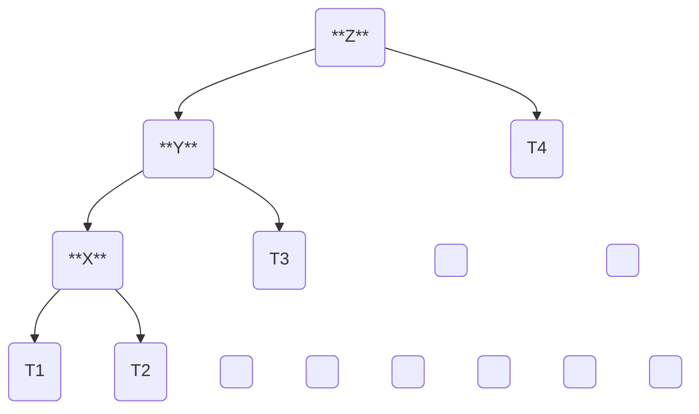
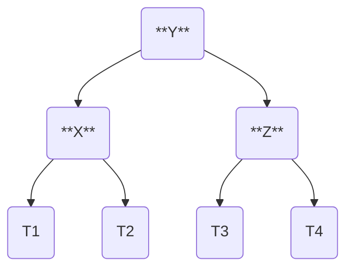
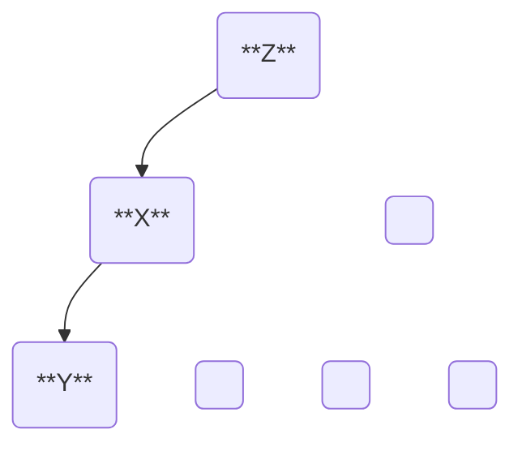
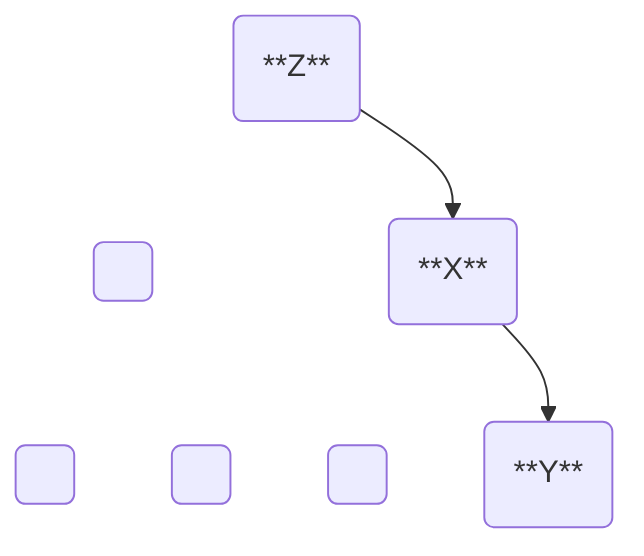
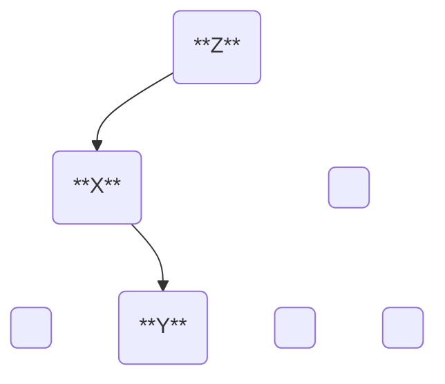
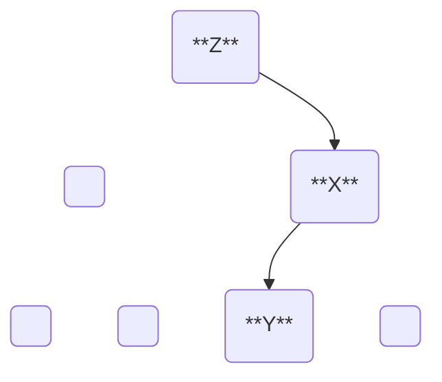

## Einführung

Ein balancierter Baum ist eine spezielle Form der Baum-Datenstruktur, die darauf
ausgelegt ist, das Gleichgewicht innerhalb des Baums aktiv zu erhalten. Dadurch
wird verhindert, dass alle Knoten auf einer Seite des Baums liegen und die
schlechteste Zeitkomplexität von $O(n)$ entsteht. Stattdessen ermöglichen
balancierte Bäume eine effiziente Durchführung von Operationen mit einer
Zeitkomplexität von $O(log n)$.

## Konzept

Ein balancierter oder selbstbalancierender Baum ist ein Baum, der versucht, sein
Gleichgewicht zu bewahren. Dies kann entweder gewichts- oder höhenbasiert
erfolgen.  
Bei einem gewichtsbalancierten Baum wird darauf geachtet, dass die Anzahl der
Knoten in jedem Teilbaum möglichst gleich ist. Ein höhenbalancierter Baum
hingegen sorgt dafür, dass die Höhe der Teilbäume möglichst ausgeglichen bleibt.

Um das Gleichgewicht zu erhalten, werden die Knoten mit einer entsprechenden
Gewichtung oder Höheninformation versehen, die bei jeder Veränderung des Baums
aktualisiert wird. Überschreitet diese Gewichtung oder Höhe einen bestimmten
Grenzwert, wird der Baum durch verschiedene Rotationen der Knoten
umstrukturiert, sodass das Gleichgewicht wiederhergestellt wird.

## Implementierung

In diesem Kapitel sollen gewisse Allgemeine Informationen zu balancierten Baumen
festgehalten werden, die für die Implementierung von solchen relevant sind.
Zusätzlich werden gewisse selbstbalancierende Bäume genauer beschrieben.

### Balance-Faktor

Eine Kerneigenschaft von balancierten Bäumen ist der Balance-Faktor. Dieser kann
für jeden Knoten im Baum berechnet werden und gibt an, wie gut der Unterbaum mit
diesem Knoten als Wurzel balanciert ist. Der Balance-Faktor wird meist Anhand der
Differenz von zwei Funktionen auf den direkten Kindknoten berechnet:

$$
BF(t) = f(t_r) - f(t_l)
$$

*Bei einem AVL-Baum ist $f(t) = Height(t)$, bei einem gewichtsbalancierten Baum
ist $f = Weight(t)$.*

Dieser Faktor wird, dann entweder auf den Knoten gespeichert oder wenn nötig berechnet.
Und sobald dieser Faktor in einem Knoten einen grenzwert überschreitet, muss der
Baum durch Rotationen neustrukturiert werden, um das Gleichgewicht wiederherzustellen.

### Rotationen

Ein grossteil der selbstbalancierenden Bäume stellen ihre Balancierung durch unterschiedliche
Rotationen sicher. Diese Rotationen sind spezielle Umstrukturierungen des Baums,
welche die Knoten neu anordnen und so die Gewichtung verändern. Dabei wird jedoch
die Relation der Knoten untereinander nicht verändert, dass heisst die Reihenfolge
in der die Knoten durchlaufen werden bleibt gleich.

Rotationen finden vor allem bei selbstbalancierenden binären Suchbäumen Anwendung
andere Bäume vor allem nicht binäre, wie zum Beispiel B-Bäume, nutzen andere Methoden.
Darunter zum Beispiel, das Teilen und Zusammenführen von Knoten oder sogar das neu
Aufbauen des gesamten Baums.

Grundsätzlich gibt es zwei Arten von Rotationen, eine Linksrotation und eine Rechtsrotation.
Diese beiden Rotationen spiegeln sich gegenseitig und können auch in Kombination
verwendet werden, um komplexere Umstrukturierungen zu erreichen.

#### Linksrotation

Für eine Linksrotation, werden drei Knoten, $x$, $y$ und $z$ betrachtet, wobei alle
drei Knoten in einer Linie liegen. Das heisst $x$ ist der rechte Kindknoten von $y$
und $y$ ist der rechte Kindknoten von $z$. Die Linksrotation dreht nun die Knoten
nach Links so das $y$ der neu Wurzelknoten wird und $x$ das rechte und $z$ das linke
Kind von $y$ wird.

Die die Knoten $T1$, $T2$, $T3$ und $T4$ sind die Teilbäume, die an den Knoten
$x$, $y$ und $z$ hängen. Diese Knoten bleiben bei der Rotation unverändert,

**Unbalancierter Baum vor der Linksrotation:**

**Balancierter Baum nach der Linksrotation:**

#### Rechtsrotation

Für eine Rechtsrotation, werden ebenfalls die drei Knoten $x$, $y$ und $z$ betrachtet,
diesmal jedoch entlang der horizontalen Achse gespiegelt. Das heisst $x$ ist das
linke Kind von $y$ und $y$ ist das linke Kind von $z$. Die Rechtsrotation dreht
nun die Knoten so, dass $y$ der neu Wurzelknoten wird und $x$ der linke und $z$
der rechte Kindknoten von $y$ wird.

Die die Knoten $T1$, $T2$, $T3$ und $T4$ sind die Teilbäume, die an den Knoten
$x$, $y$ und $z$ hängen. Diese Knoten bleiben bei der Rotation unverändert,

**Unbalancierter Baum vor der Rechtsrotation:**

**Balancierter Baum nach der Rechtsrotation:**

### Selbstbalancierende Bäume

Hier werden einige der am verbreitetsten selbstbalancierenden Bäume etwas genauer
dokumentiert und erklärt.

#### AVL-Baum

Der AVL-Baum benannt nach seinen Erfindern **A**delson-**V**elsky und **L**andis
ist ein selbstbalancierender binärer Suchbaum, der sicherstellt, dass die Such,
Einfüge- und Löschoperationen in logarithmischer Zeit durchgeführt werden können.

Als Balance-Faktor wird die Höhe des linken Teilbaums von der Höhe des rechten
Teilbaums subtrahiert. Ein AVL-Baum ist dann balanciert, wenn dieser Faktor für
alle Knoten im Baum zwischen -1 und 1 liegt. Wenn dieser Faktor ausserhalb dieser
Limite liegt, wird der Baum durch Rotationen neu strukturiert.

$$
\text{BF}(t) = \text{Height}(t_l) - \text{Height}(t_r)
$$

$$
AVL-Bedingung: -1 \leq \text{BF}(t) \leq 1
$$

Ein AVL-Baum bietet dann die selben Operationen wie ein normaler binärer Suchbaum,
dabei wird jedoch nach der Durchführung der Operationen immer die balance des Baums
aktualisiert und gegebenenfalls durch Rotationen korrigiert.

Da der AVL-Baum den Balance-Faktor strikt zwischen -1 und 1 hält, kann durch eine
Einfügung oder Löschung höchstens ein ungleichgewicht mit Balance-Faktor 2 (-2)
entstehen. Dabei gibt es vier unterschiedliche Fälle, welche ein solches Ungleichgewicht
haben.

Beim Links-Links fall wird an einem bereits linkslastigem Baum ein weiterer Knoten
auf der linken Seite angefügt. Dies kann durch eine Rechtsrotation behoben werden.
Im Gegenteil dazu steht der Rechts-Rechts Fall, bei dem ein Knoten auf der rechten
Seite eines bereits rechtlastigen Baums angefügt wird. Hier kann eine Linksrotation
das Gleichgewicht wiederherstellen.



**Links-Links Fall:**



**Rechts-Rechts Fall:**



Beim Links-Rechts Fall wird ein Knoten auf der rechten Seite eines bereits linkslastigen
Knotens angefügt. Hier wird zuerst eine Linksrotation auf den linken Knoten durchgeführt,
um den Baum in einen Links-Links Fall zu verwandeln. Danach wird eine Rechtsrotation
auf den Knoten durchgeführt, um das Gleichgewicht wiederherzustellen.
Das Gegenteil dazu ist der Rechts-Links Fall, bei dem ein Knoten auf der linken
Seite eines bereits rechtlastigen Knotens angefügt wird. Hier wird zuerst eine
rechtsrotation auf den rechten Knoten durchgeführt, um den Baum in einen Rechts-Rechts
Fall zu verwandeln. Danach wird eine Linksrotation auf den Knoten durchgeführt,
um das Gleichgewicht wiederherzustellen.



**Links-Rechts Fall:**



**Rechts-Links Fall:**



## Ressourcen

[AVL-Baum - Wikipedia][avl-wiki]  
[Selbstbalancierender binärer Suchbaum - Wikipedia][sbbst-wiki]  

[avl-wiki]: https://de.wikipedia.org/wiki/AVL-Baum
[sbbst-wiki]: https://en.wikipedia.org/wiki/Self-balancing_binary_search_tree
