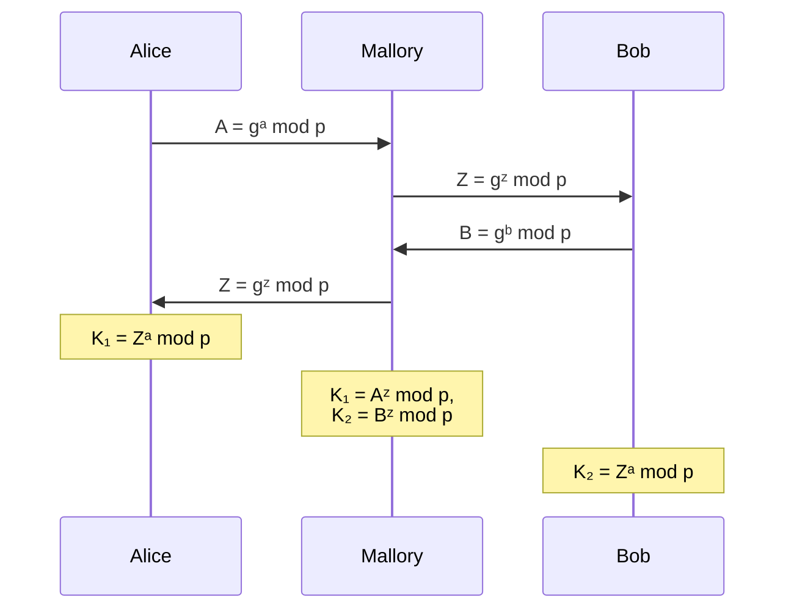

## Einführung

Der [Diffie-Hellman-Schlüsselaustausch][diffie-hellman-wiki] ist ein Verfahren zur
Schlüsselvereinbarung zwischen zwei Parteien. Es ermöglicht es diesen einen gemeinsamen
geheimen Schlüssel über einen öffentlichen Kanal auszutauschen, ohne dass ein dritter
diesen Schlüssel einsehen kann. Dieser Schlüssel kann anschliessend für eine symmetrische
Verschlüsselung der folgenden Kommunikation verwendet werden.

Das Verfahren wurde 1976 von Whitfield Diffie und Martin Hellman entwickelt und
und basiert auf den Erkentnissen von Ralph Merkle, auf Grund der Wichtigkeit dieser
Vorarbeiten schlug Hellman vor auch seinen Namen in den Titel aufzunehmen, der Begriff
Diffie-Hellman-Merkle-Schlüsselaustausch ist jedoch nicht verbreitet.

## Grundlagen

Die Wirksamkeit des Diffie-Hellman-Verfahrens basiert auf einer Einwegfunktion.
Dies ist eine Funktion, welche *"leicht"* zu berechnen ist aber nur *"schwer"* oder
gar nicht umkehrbar ist. In vielen kryptographischen Verfahren ist diese Einwegfunktion
die diskrete Exponentialfunktion, auch modulare Exponentialfunktion genannt.

$$b^e \equiv x \pmod m$$

Die Umkehrung dieser Funktion ist der diskrete Logarithmus, welche für eine bekannte
Basis $b$ und Modul $m$ den Exponenten $e$ berechnet. Jedoch gibt es Heute keine
bekannte Methode um den diskreten Logarithmus effizient zu berechnen, wodurch diese
Berechnung für grosse Zahlen als praktisch unmöglich gilt.

$$\log_b(x) \equiv e \pmod m$$

### Wahl eines Generators

Im Rahmen des Diffie-Hellman-Verfahrens wird anstelle von $b$ von einem Generator
$g$ gesprochen. Dieser Generator generiert durch die wiederholte Anwendung der
Multiplikation zu einem Modul $m$ Werte, welche in der Gruppe ($\mathbb{Z}/n\mathbb{Z}$)
enthalten sind, wobei $n$ der Modul ist. Diese wiederholte Anwendung der Multiplikation
kann durch die diskrete Exponentialfunktion dargestellt werden:

$$ g \cdot g \ldots g \cdot g \equiv g^x \pmod m $$

In diesem Unterkapitel soll kurz beschrieben werden, weshalb diese Wahl wichtig
ist.

Eine Gruppe wird durch das Paar (G,\*)$ bestehend aus einer Menge $G$ und einer
Verknüpfung $*$, für die das [assoziativ Gesetz][assoziativ-law] gilt, gebildet.
Zusätzlich muss diese Gruppe ein neutrales Element $e$ enthalten, welches für alle
Elemente $a \in G$ die Bedingung $e \* a = a \* e = a$ erfüllt. Und jedes Element
$a \in G$ muss ein inverses Element $a^{-1} \in G$ besitzen, welches die Bedingung
$a \* a^{-1} = a^{-1} \* a = e$ erfüllt.

Ein Beispiel für eine solche Gruppe ist die Gruppe der ganzen Zahlen mit der Addition
als Verknüpfung. Dabei ist $0$ das neutrale Element da für jede ganze Zahl $a$ gilt
$a + 0 = a$. Und jedes Element $a$ hat ein inverses Element $-a$, da
$a + (-a) = 0$ gilt. Im speziellen Fall, dass für die Verknüpfung auch das
[Kommutativgesetz][commutative-law] gilt, wird von einer abelschen Gruppe gesprochen.  

Eine spezielle Art von Gruppen sind die sogenannten primen Restklassengruppen.
Diese sind definiert als die Menge aller Restklassen modulo einer Primzahl $p$
und der Multiplikation als Verknüpfung. Diese Gruppen werden mit $\mathbb{Z}_p^*$
bezeichnet. Dabei ist es wichtig, zu erwähnen, das nicht jeglicher Wert der Restklasse
modulo $p$ ein Element dieser Gruppe ist, sondern nur die Werte, für welche ein
multiplikatives Inverses existiert. Dies ist genau dann der Fall, wenn der Wert
nicht $0$ und teilerfremd zu $p$ ist, dies ist der Grund weshalb eine Primzahl
als Modul verwendet wird.

Nun kann ein beliebiges Element $a$ aus $\mathbb{Z}_p^\*$ gewählt werden, für welches
die Menge $\lbrace a, a^2, a^3, \ldots, a^{p-1} \pmod p\rbrace$ betrachtet wird.
So erhält man eine Untergruppe von \$\mathbb{Z}_p^*$ zum Generator $a$. Die Menge
der in der Untergruppe enthaltenen Elemente wird als die Ordnung des Generators
bezeichnet. Diese Ordnung ist immer eine Teilmenge der Ordnung der Gruppe, jedoch
nicht immer gleich. Die Wahl eines Generators mit hoher Ordnung ist in kryptographischen
Systemen wichtig, da es die Möglichen Werte für den geheimen Schlüssel und somit
die Sicherheit des Systems erhöht. Im folgenden wird die Ordnung des Generators
$2$ und $3$ in $\mathbb{Z}\_{13}^\*$, auch $\mathbb{F}\_{13}$, aufgezeigt:



$$
2^1 \equiv 2 \pmod{13} \\\
2^2 \equiv 4 \pmod{13} \\\
2^3 \equiv 8 \pmod{13} \\\
2^4 \equiv 3 \pmod{13} \\\
2^5 \equiv 8 \pmod{13} \\\
2^6 \equiv 12 \pmod{13} \\\
2^7 \equiv 11 \pmod{13} \\\
2^8 \equiv 9 \pmod{13} \\\
2^9 \equiv 5 \pmod{13} \\\
2^{10} \equiv 10 \pmod{13} \\\
2^{11} \equiv 7 \pmod{13} \\\
2^{12} \equiv 1 \pmod{13} \\\
$$

Für den Generator $2$ ist die Ordnung als $12$ und man erhält alle Elemente der
Gruppe $\mathbb{F}\_{13}$.



$$
3^1 \equiv 3 \pmod{13} \\\
3^2 \equiv 9 \pmod{13} \\\
3^3 \equiv 1 \pmod{13} \\\
3^4 \equiv 3 \pmod{13} \\\
3^5 \equiv 9 \pmod{13} \\\
3^6 \equiv 1 \pmod{13} \\\
3^7 \equiv 3 \pmod{13} \\\
3^8 \equiv 9 \pmod{13} \\\
3^9 \equiv 1 \pmod{13} \\\
3^{10} \equiv 3 \pmod{13} \\\
3^{11} \equiv 9 \pmod{13} \\\
3^{12} \equiv 1 \pmod{13} \\\
$$

Für den Generator $3$ ist die Ordnung nur $3$ und man erhält nur die Untergruppe
$\lbrace 1, 3, 9 \rbrace$ aus der Gruppe $\mathbb{F}\_{13}$.



Enthält eine Generator alle Elemente der Gruppe $\mathbb{Z}\_p^\*$ so ist dieses
Element eine primiteve Wurzel modulo $p$. In diesem Fall ist $2$ eine primitive
Wurzel modulo $13$, da es alle Elemente der Gruppe $\mathbb{F}\_{13}$ enthält.  
Eine Primzahl $p$ hat genau $\varphi(p-1)$ primitive Wurzeln, wobei $\varphi$ die
euler'sche Phi-Funktion ist. Diese bestimmt die Anzahl der natürlichen Zahlen kleiner
als $n$, welche teilerfremd zu $n$ sind. Für die Primzahl $13$ ist
$\varphi(12) = 4$, es gibt also vier primitive Wurzeln modulo $13$ (nämlich $2$,
$6$, $7$ und $11$).

Obwohl bewiesen ist, dass es für jede Primzahl $p$ $\varphi(p-1)$ primitive Wurzeln
gibt, ist es in der Praxis schwierig diese zu finden, da es keinen bekannten Algorithmus
zur effizienten Bestimmung dieser gibt. Somit bleibt es nur möglich, Generatoren
zu Wählen und dann zu prüfen, ob es sich bei diesem um eine primitive Wurzel handelt.
Dies kann mit folgender Bedingung überprüft werden:

$$
g^{p-1} \equiv 1 \pmod{p}\thickspace\text{und}\thickspace g^i \not\equiv 1
\pmod{p}\thickspace \text{für} \thickspace 2 \leq i \leq p - 2
$$

Diese Überprüfung ist jedoch aufwändig und für grosse Primzahlen, wie sie in der
Kryptographie Anwendung finden, nicht praktikabel. Falls jedoch die Primfaktorzerlegung
von $p - 1$ bekannt ist, kann die überprüfung deutlich effizienter durchgeführt
werden, da nur die folgende Bedingung erfüllt werden muss:

$$
g^{\frac{p-1}{p\_i}} \not\equiv 1 \pmod{p}\thickspace \text{für alle Primfaktoren}
\thickspace p\_i \in p
$$

## Funktionsweise







Die Funktionsweise des Diffie-Hellman-Schlüsselaustausch-Protokolls kann sehr gut
mit der Mischung von Farben veranschaulicht werden. Dabei symbolisieren die Farben
die verwendeten Zahlen und die Mischung der Farben die diskrete Exponentialfunktion.

Hierbei die Einwegfunktion, das Mischen der Farben, intuitiv erkennbar. Denn es
ist einfach zwei Farben in einem Behälter zu mischen, jedoch ist es fast nicht möglich
herauszufinden, welche zwei Farben gemischt wurden, um eine bestimmte Farbe zu erhalten.

Alice und Bob einigen sich zuerst auf eine gemeinsame Farbe (im Beispiel Gelb),
diese Farbe ist öffentlich bekannt. Danach wählen beide eine geheime Farbe, welche
sie mit der gemeinsamen Farbe mischen. Diese gemischten Farben tauschen sie dann
untereinander, über den öffentlichen Kanal, aus. Wenn nun beide ihre geheime Farbe
in die gemischte Farbe des anderen mischen, so erhalten sie beide die gleiche Farbe,
welche nur ihnen bekannt ist. Für Eve, welche den öffentlichen Kanal belauscht,
ist es nicht möglich die geheime Farbe herauszufinden, da sie nur die ursprüngliche
gemeinsame Farbe und die gemischten Farben kennt.



### Mathematische Funktionsweise

Bei einer digitalen Kommunikation über einen unsicheren Kanal, wie zum Beispiel
dem Internet, muss für eine sichere Kommunikation eine Verschlüsselung verwendet
werden. Es kann jedoch auch sinnvoll sein, jeglichen Kanal als unsicher zu betrachten.
Diese Kommunikation wird meist symmetrisch verschlüsselt, da die symmetrische Verschlüsselung
viel schneller als die asymmetrische Verschlüsselung ist. Für eine solche Verschlüsselung
wird jedoch ein gemeinsamer geheimer Schlüssel benötigt. Für den sicheren Austausch
dieses Schlüssels wird das Diffie-Hellman-Verfahren verwendet.

1. Alice und Bob einigen sich zunächst **öffentlich** auf eine Primzahl $p$ und
   eine Generator $g$. Diese beiden Werte sind meist durch unterschiedliche Standards
   vorgegeben, können jedoch auch von den Parteien selbst gewählt werden.  
   Diese beiden Werte sind für die Sicherheit des Verfahrens nicht geheim und können
   ohne Bedenken über einen unsicheren Kanal ausgetauscht werden.
2. Alice und Bob erzeugen jeweils eine geheime Zufallszahl (privater Schlüssel)
   $a$ bzw. $b$ aus der Menge $\lbrace 1, \ldots, p - 1 \rbrace$. Diese beiden
   Zahlen sind für die Sicherheit des Verfahrens entscheidend und **müssen** geheim
   gehalten werden. Sie dürfen weder einem Lauscher wie Eve noch der anderen Partei
   bekannt sein.
3. Alice berechnet nun ihren öffentlichen Schlüssel $A \equiv g^a \pmod p$ und schickt
   $A$ über den öffentlichen Kanal an Bob.  
   Bob berechnet nun seinen öffentlichen Schlüssel $B \equiv g^b \pmod p$ und schickt
   $B$ über den öffentlichen Kanal an Alice.
4. Alice erhält nun den öffentlichen Schlüssel $B$ von Bob und berechnet mit diesem
   und ihrem privaten Schlüssel $a$ den gemeinsamen geheimen Schlüssel $K_1 \equiv
   B^a \pmod p$.  
   Bob erhält nun den öffentlichen Schlüssel $A$ von Alice und berechnet mit diesem
   und seinem privaten Schlüssel $b$ den gemeinsamen geheimen Schlüssel $K_2 \equiv
   A^b \pmod p$.  
   Die beiden haben nun den gleichen geheimen Schlüssel $K$, da $K_1 = K_2$

Nach diesem Austausch können nur Alice und Bob den gemeinsamen geheimen Schlüssel
kennen, da es Anhand der öffentlichen Werte $p$, $g$, $A$ und $B$ nicht möglich
ist $K$ zu berechnen. Insofern, dass diskrete Logarithmusproblem für grosse Zahlen
weiterhin als praktisch unlösbar gilt.

Der Beweis, dass beide tatsächlich den gleichen geheimen Schlüssel erhalten wird
anhand der folgenden Gleichung erbracht:

$$
K_1 = B^a \mod{p} = (g^b \mod{p})^a \mod{p} = g^{ba} \mod{p} \\\
K_2 = A^b \mod{p} = (g^a \mod{p})^b \mod{p} = g^{ab} \mod{p}
$$

Da die Multiplikation kommutativ ist, gilt des weiteren:

$$
g^{ba} \mod{p} = g^{ab} \mod{p}
$$

und somit:

$$
K_1 = K_2
$$

## Programmierung

Die Implementation des DHM-Verfahrens als Programmcode ist relativ einfach, gegeben,
dass die benötigten Funktionen durch die Programmiersprache oder eine Bibliothek
unterstützt werden.

{}

Für die Auswahl der Parameter $p$ und $g$ gibt es verschiedene Standards, einer
davon ist der [RFC 7919][rfc7919], welcher eine Sammlung von Gruppenparametern
beinhaltet.  
Alternative können auch die Parameter aus von den beiden Parteien selbst gewählt
werden.

{}



from random import randint

# Definition of group parameters

## ffdhe2048
## p = 2^2048 - 2^1984 + {[2^1918 * e] + 560316 } * 2^64 - 1
p = 0xFFFFFFFFFFFFFFFFADF85458A2BB4A9AAFDC5620273D3CF1D8B9C583CE2D3695A9E13641146433FBCC939DCE249B3EF97D2FE363630C75D8F681B202AEC4617AD3DF1ED5D5FD65612433F51F5F066ED0856365553DED1AF3B557135E7F57C935984F0C70E0E68B77E2A689DAF3EFE8721DF158A136ADE73530ACCA4F483A797ABC0AB182B324FB61D108A94BB2C8E3FBB96ADAB760D7F4681D4F42A3DE394DF4AE56EDE76372BB190B07A7C8EE0A6D709E02FCE1CDF7E2ECC03404CD28342F619172FE9CE98583FF8E4F1232EEF28183C3FE3B1B4C6FAD733BB5FCBC2EC22005C58EF1837D1683B2C6F34A26C1B2EFFA886B423861285C97FFFFFFFFFFFFFFFF
g = 2

# Key generation
## Alice's key part
a = randint(1, p - 1)  # Alice's private key
A = pow(g, a, p)  # Alice's public key

print("Alice's public key:", hex(A))

## Bob's key part
b = randint(1, p - 1)  # Bob's private key
B = pow(g, b, p)  # Bob's public key

print("Bob's public key:", hex(B))

# Echange of public keys

# Shared secret calculation
## Alice calculates the shared secret
K_1 = pow(B, a, p)  # Alice's shared secret

## Bob calculates the shared secret
K_2 = pow(A, b, p)  # Bob's shared secret

print(f"Alice's shared key: {hex(K_1)}")
print(f"Bob's shared key: {hex(K_2)}")



### Arbitrary Precision Integers

Für die Implementation des DHM-Verfahrens innerhalb eines Programms reichen die
aktuellen 64bit (je nach Computer auch 128bit) Register des Prozessors nicht aus,
um Zahlen zu speichern, welche für eine Sichere Anwendung des DHM-Verfahrens benötigt
werden. Das heisst es wird ein spezialisierter Zahlen-Typ benötigt, welcher *beliebig*
grosse Ganzzahlen speichern kann. Gewisse Programmiersprachen, wie zum Beispiel
JavaScript oder Python, bieten solche Typen direkt an, für andere Sprachen muss
eine Bibliothek verwendet werden, welche diese Funktionalität bereitstellt, zum
Beispiel frei [GNU Multiple Precision Arithmetic Library (GMP)][gmp] verwendet werden.

### Fast modular exponentiation

Zusätzlich wird für das DHM-Verfahren ein Algorithmus zur effizienten Berechnung
der diskreten Exponentialfunktion benötigt. Dies ist besonders der Fall, da für
die sichere Anwendung des Verfahrens gigantische Exponenten verwendet werden, welches
mit einem naiven Algorithmus, zum Beispiel durch die wiederholte Multiplikation,
praktisch unmöglich machen das Ergebnis in einem vernünftigen Zeitrahmen zu berechnen.
Viele Programmiersprachen oder Bibliotheken implementieren dazu Beispielsweise den
Algorithmus der [Binären exponentiation][binary-exponentiation] oder
[Montgomery Arithmetik][montgomery-arithmetic].

## Sicherheit

Die Sicherheit des DHM-Verfahrens basiert auf unterschiedlichen Faktoren. Diese
Faktoren sind hier nochmals aufgelistet und kurz erklärt:

### Diffie-Hellman-Problem

Das Diffie-Hellman-Problem ist die Grundlage, dafür dass es für einen Lauscher
nicht möglich ist den gemeinsamen geheimen Schlüssel mitzubekommen. Dieses besteht
aus zwei Teilproblemen.

#### Computational-Diffie-Hellman Problem (CDH)

Angenommen, die Lauscherin Eve erfährt auf dem unsicheren Kanal die Zahlen $p$,
$g$, $A$ und $B$. Ist es für Eve möglich den gemeinsamen geheimen Schlüssel $K$
oder die nicht übertragenen Zahlen $a$ oder $b$, welche es trivial machen würden
$K$ zu berechnen, herauszufinden. Die Problemstellung lautet also:

> Wenn ein Element $g$ einer Gruppe und die Werte $A \equiv g^a \pmod p$ und
> $B \equiv g^b \pmod p$ gegeben sind, welchen Wert hat $K \equiv g^{ab} \pmod p$,
> mit $a$, $b$ unbekannt?

Bei der Wahl von sehr grossen Zahlen für $p$, $a$ und $b$ sehr grosse Werte sind,
in modernen Systemen mehr als 1024 Bit, ist heute keine Lösung für dieses Problem
bekannt.

Diese Problem ist sehr eng mit dem diskreten Logarithmus-Problem verbunden, denn
sobald der diskrete Logarithmus effizient berechnet werden kann, ist es trivial
$a$ und $b$ anhand von $g$, $p$ und $A$ bzw. $B$ zu berechnen und somit auch das
CDH-Problem zu lösen. Es ist allerdings noch nicht bewiesen, dass dies tatsächlich
die einzige Möglichkeit ist, das CDH-Problem zu lösen.

#### Decisional-Diffie-Hellman Problem (DDH)

Sollte es für einen Angreifer unmöglich sein, aus den öffentlich bekannten Informationen
irgendwelche Informationen über den gemeinsamen geheimen Schlüssel zu gewinnen (CDH),
so muss es für diesen auch unmöglich sein, das Decisional-Diffie-Hellman (DDH) Problem
zu lösen. Dieses Problem lässt sich wie folgt formulieren:

> Ein Angreifer erhält drei Zahlen $A \equiv g^a \pmod p$, $B \equiv g^b \pmod p$
> und $C \equiv g^c \pmod p$. Dabei wurden entweder $a$, $b$ und $c$ zufällig und
> gleichverteilt aus der Menge $\lbrace 1, \ldots, p - 2 \rbrace$ gewählt oder
> $c \equiv ab \pmod p$ gesetzt. Im zweiten Fall spricht man bei $(A, B, C)$ von
> einem Diffie-Hellman-Trupel. Der Angreifer muss nun entscheiden, ob es sich bei
> den drei Zahlen um ein solches Tripel handelt oder nicht. Kann er das nicht, ist
> es ihm nicht möglich, aus $g^a$ und $g^b$ einen Rückschluss auf $g^{ab}$ zu ziehen.

Das Problem besteht also darin für die gegebenen Werte $g^a$, $g^b$ und $g^c$ zu
entscheiden, ob $g^{ab} = g^c$ wahr ist.

### Wahl der öffentlichen Parameter

#### DHM-Primzahl $p$

Die Sicherheit des DHM-Verfahrens ist stark von der Länge der gewählten Zahlen abhängig.
So ist besonders die Wahl der Primzahl $p$ relevant um diese Länge zu gewährleisten.
Aktuell wird empfohlen eine Primzahl $p$ mit einer Länge von mindestens 2048 Bit
zu verwenden.  
Zusätzlich gibt es gewisse Faktoren, welche die Berechnung des diskreten Logarithmus
stark vereinfachen können. So muss beispielsweise vermieden werden, dass $p - 1$
nur kleine Primfaktoren enthält um zu verhindern, dass der [Pohling-Hellman-Algorithmsu][pohling-hellman-algorithm]
angewendet werden kann. Zusätzlich sollte $p$ möglichst ungeeignet für das [Zahlkörpersieb][Zahlkörpersieb]
sein.

#### Generator $g$

Neben der Wahl der Primzahl $p$ ist auch die Wahl des Generators $g$ in der Gruppe
$Z\_p^\*$ sehr wichtig, da es mit einem schlechten Generator möglich ist, die Ordnung
der Teilgruppe und somit die Sicherheit des Verfahrens drastisch zu verringern.
Deshalb sollte der Generator $g$ möglichst so gewählt werden, dass alle Elemente
der Gruppe $Z_p^*$ enthalten sind. Je nach dem kann die Wahl von $g$ als primitiv
Wurzel jedoch auch die Sicherheit des Verfahrens reduzieren, da auf diese Weise
das DDH-Problem besser angegriffen werden kann.

#### Verwendung von festen Parametern

Da die Erzeugung von sicheren Primzahlen und guten Generatoren rechenaufwendig ist,
wählen viele Systeme ihre Parameter aus einer öffentlich bekannten Liste von *guten*
Parametern aus.  
Hierbei gilt es fast wie überall in der Kryptographie, die motivation der Herausgeber
und somit die Sicherheit der Parameter zu hinterfragen. Wichtiger jedoch ist, dass
öffentlich bekannte Parameter dazu führen, dass Angreifer einen grossteil des Rechenaufwendigen
Teil der Berechnungen bereits im voraus durchführen können. So ist es Beispielsweise
bereits nach einwöchiger Vorberechnung möglich einen 512-Bit DHM Schlüsselaustausch
in gut einer Minute zu brechen.

### Man-in-the-Middle-Angriff

Das DHM-Verfahren stellt den Sicheren Austausch eines gemeinsamen geheimen Schlüssels
sicher, **nicht** jedoch die Authentizität der Parteien. So ist es für einen Angreifer,
Mallory, der Aktiv in das Geschehen eingreifen kann ein leichtes die Kommunikation
abzuhören. Dazu ersetzt Mallory die öffentlichen Schlüssel vom Alice und Bob jeweils
durch ihren eigenen öffentlichen Schlüssel wodurch Alice und Bob jeweils ein DHM-Schlüsselaustausch
mit Mallory durchführen.

Nach dem Schlüsselaustausch besitzen Alice und Bob zwei unterschiedliche Schlüssel
$K_1$ und $K_2$. Sie nehmen jedoch an dass sie beide den gleichen Schlüssel haben
und verschlüsseln nun ihre Kommunikation mit diesem Schlüssel. Mallory, die im
Besitz beider Schlüssel ist, kann nun die Kommunikation jeweils entschlüsseln, abhören,
manipulieren und an den jeweiligen Empfänger erneut verschlüsselt weiterleiten.
Wodurch diese den Angriff nicht bemerken.

Um einen solchen Angriff zu verhindern, müssen die ausgetauschten Nachrichten
authentifiziert werden. Dies kann durch unterschiedliche digitale Signaturalgorithmen
erreicht werden. Diese Authentifizierung setzt jedoch einen Informationsvorsprung
voraus, da die beiden Parteien im voraus sicherstellen müssen, dass die Signatur
zur tatsächlichen Person gehört und nicht auch durch Mallory gefälscht wurde.

### Seitenkanalangriffe

Ein weitere Möglichkeit, das Verfahren anzugreifen, sind sogenannte Seitenkanalangriffe.
Diese bezeichnen kryptoanalytische Methoden, die nicht das Verfahren selbst sondern
die tatsächliche Implementierung angreifen. Dabei wird versucht, Informationen
über den geheimen Schlüssel anhand von Nebenwirkungen der Implementierung zu
erfahren.  
So ist es Beispielsweise möglich, den geheimen Schlüssel anhand der Zeit, welche
für die Berechnung der diskreten Exponentialfunktion benötigt wird, zu ermitteln.
Dies ist möglich, da viele Implementationen der diskreten Exponentialfunktion den
Square-and_Multiply-Algorithmus verwendet, welcher basierend auf dem zu bearbeitenden
Bit des Schlüssels unterschiedliche Operationen durchführt, welche einen unterschiedlichen
Zeitaufwand benötigen.

## Ressourcen

[Diffie-Hellman-Schlüsselaustausch - Wikipedia][diffie-hellman-wiki]  
[RFC 7919 - Groups for Authenticated Key Exchange][rfc7919]  

[diffie-hellman-wiki]: https://de.wikipedia.org/wiki/Diffie-Hellman-Schl%C3%BCsselaustausch
[assoziativ-law]: https://de.wikipedia.org/wiki/Assoziativgesetz
[commutative-law]: https://de.wikipedia.org/wiki/Kommutativgesetz
[gmp]: https://gmplib.org/
[rfc7919]: https://datatracker.ietf.org/doc/html/rfc7919
[binary-exponentiation]: https://de.wikipedia.org/wiki/Bin%C3%A4re_Exponentiation
[montgomery-arithmetic]: https://en.wikipedia.org/wiki/Montgomery_modular_multiplication
[pohling-hellman-algorithm]: https://de.wikipedia.org/wiki/Pohlig-Hellman-Algorithmus
[zahlkörpersieb]: https://de.wikipedia.org/wiki/Zahlkörpersieb
