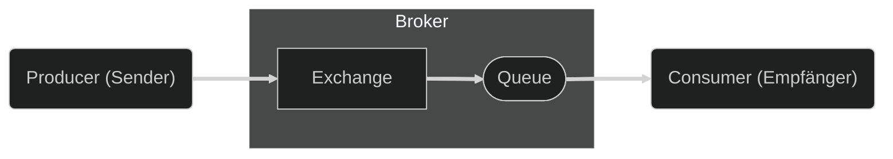
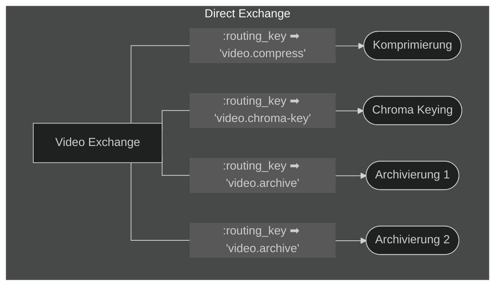
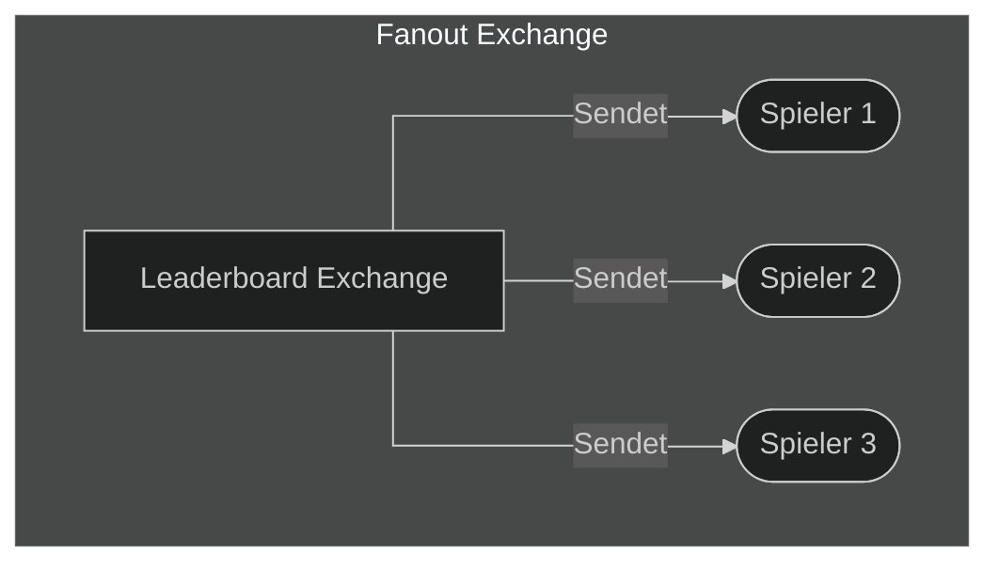

## Was ist das Advanced Message Queuing Protocol (AMQP)?

Das Advanced Message Queuing Protocol (AMQP) ist ein offener Standard für
Nachrichtenorientierte Middleware. AMQP definiert ein Nachrichtenformat, welches
von Clients genutzt werden kann um Nachrichten an einen Vermittler (Broker) zu
senden. Dieser Broker fügt die Nachrichten in eine Warteschlange ein, von der
sie durch einen anderen Client abgeholt und bearbeitet werden.

## Zweck

AMQP ermöglicht die Kommunikation zwischen verschiedenen System über einen
Broker so findet AMQP Anwendung in verteilten Systemen. AMQP ermöglicht es
allen Systemen, die den Standard nutzen miteinander zu kommunizieren. Dies
ermöglicht es, dass Systeme unabhängig voneinander entwickelt werden, wodurch
diese leichter zu warten und erweitern sind, dazu ist es einfacher ein System
zu skalieren.

## Funktionsweise

AMQP ist ein Netzwekprotokoll, welches auf dem TCP/IP Protokoll aufbaut. AMQP
kennt dabei drei verschiedene Teilnehmer, den Producer (Sender), den Broker und
den Consumer (Empfänger). Der Producer erzeugt Nachrichten und sendet diese an
den Broker, im Broker werden diese von einem Exchange empfangen und an eine
gebundenen Queue weitergeleitet. Der Consumer kann die Nachrichten aus der Queue
abholen und verarbeiten. Grob sieht der Ablauf wie folgt aus:

Der Producer sendet eine Nachricht mit verschiedenen Attributen an den Exchange
des Brokers. Je nach Exchange Typ wird die Nachricht, dann an x-beliebig viele
Queues weitergeleitet, welche die Nachricht and die interessierten Consumer
weiterleitet.

Dabei ist AMQP ein Programmierbares Protokoll, dass heisst die Exchanges und
Queues müssen nicht bereits im Vorhinein definiert sein, sondern können durch
die Clients erstellt und konfiguriert werden. So kann jeder
Applikationsentwickler mit seiner Applikation die Exchanges und Queues
erstellen, welche seine Applikation benötigt.

### Broker

Der Broker ist der zentrale Bestandteil von AMQP. Der Broker ist für die
Verteilung der Nachrichten zuständig. Jegliche Clients melden sich beim Broker
an und können dann über den Broker Nachrichten über die Exchanges
veröffentlichen und über die Queues konsumieren.

### Exchanges

Exchanges in AMQP sind Entitäten, welche Nachrichten von Producern empfangen und
an 0 oder mehr Queues weiterleiten. Die Regeln, nach denen eine Nachricht
weitergeleitet wird basiert auf dem Exchange Typ und dessen Bindings.
Der AMQP 0-9-1 Standard definiert hier 4 verschiedene Exchange Typen,
spezifische Implementation eines Brokers könnten jedoch weitere definieren.
Diese Weiterleitung erstellt dabei eine Kopie der Nachricht, wodurch jegliche
weitere Nachricht individuell behandelt werden kann.



| Exchange Typ     | Name des vordefinierten Exchanges     |
| :--------------- | :------------------------------------ |
| Direct exchange  | `""` (leerer String) und `amq.direct` |
| Fanout exchange  | `amq.fanout`                          |
| Topic exchange   | `amq.topic`                           |
| Headers exchange | `amq.match`                           |



Eine Exchange Instanz besteht dabei aus den folgenden Attributen:

- **Name**: Der Name des Exchanges, über den dieser identifiziert wird.
- **Type**: Der Typ des Exchanges, bestimmt wie die Nachrichten weitergeleitet
  werden.
- **Durability**: Bestimmt ob der Exchange einen Neustart übersteht.
- **Auto-delete**: Bestimmt ob der Exchange gelöscht wird, wenn keine Queues
  mehr an diesen gebunden sind.
- **Arguments (optional)**: Weitere Argumente, welche von plugins oder
  Broker-Spezifischen Features gebraucht werden.

#### Default / Nameless Exchange

Der Nameless Exchange ist ein spezieller Exchange, welcher in der
AMQP-Spezifikation definiert wird. Dieser funktioniert wie ein Direct Exchange,
hat jedoch keinen Namen (`""`). Jede Queue muss automatisch an diesen Exchange,
mit ihrem Namen als Routing Key gebunden werden.

#### Direct Exchange

Der Direct Exchange leitet Nachrichten basierend auf ihrem Routing Key weiter.
Eine Weiterleitung findet statt, wenn der Routing Key `K`, mit dem Binding Key
`B` übereinstimmt, also `K == B`. Dabei muss jeder Broker einen Standard Direct
Excahnge mit dem Namen `amq.direct` bereitstellen.  
Ein solcher Exchange eignet sich besonders für [Unicast](https://de.wikipedia.org/wiki/Unicast) Nachrichten, kann jedoch
auch für einen [Multicast](https://de.wikipedia.org/wiki/Multicast) verwendet werden.

Dabei sieht der Ablauf wie folgt aus:

- Eine Queue bindet sich an den Exchange mit einem Binding Key `B`.
- Eine Producer sendet eine Nachricht mit einem Routing Key `K`.
- Die Nachricht wird an die Queue weitergeleitet, wenn `K == B`.

Als Graph kann ein Direct Exchange wie folgt dargestellt werden:

#### Fanout Exchange

Der Fanout Exchange leitet jede Nachricht bedingungslos an alle gebundenen
Queues weiter. Das heisst der Routing Key wird ignoriert. Dabei erhalten alle
N Queues eine Kopie der ursprünglichen Nachricht. Jeder Broker muss einen
Fanout Exchange mit dem Namen `amq.fanout` bereitstellen.  
Ein solcher Exchange eignet sich besonders für ein [Broadcast](https://de.wikipedia.org/wiki/Broadcast) von Nachrichten.
Wenn jeder Konsument über eine Nachricht informiert werden soll.

Dabei sieht der Ablauf wie folgt aus:

- Eine Queue bindet sich an den Exchange.
- Ein Producer sendet eine Nachricht an den Exchange.
- Die Nachricht wird an alle Queues weitergeleitet, die an den Exchange gebunden
  sind.

Als Graph kann ein Direct Exchange wie folgt dargestellt werden:

#### Topic Exchange

Der Topic Exchange leitet Nachrichten basierend auf einem Pattern weiter. Dieser
ermöglicht es Nachrichten in einem [Publish/Subscribe](https://de.wikipedia.org/wiki/Publish/Subscribe) System, wie zum Beispiel
auch bei [MQTT](https://de.wikipedia.org/wiki/MQTT), zu veröffentlichen. Dies ermöglicht es einen [Multicast](https://de.wikipedia.org/wiki/Multicast) zu
erstellen, bei welchem die Consumer selektiv entscheiden können, welche
Nachrichten sie empfangen möchten.  
Dieser Exchange sollte von Brokern umgesetzt werden, wenn dies der Fall ist,
muss ein Topic Exchange mit dem Namen `amq.topic` bereitgestellt werden.

Das Topic eines Routing Keys besteht dabei aus 0 oder mehr Wörtern, welche durch
einen Punkt (`.`) getrennt sind. Dabei dürfen die Wörter die Buchstaben `A-Z`,
`a-z` sowie die Zahlen `0-9` enthalten.  
Ein Binding Key folgt dem gleichen Schema wie ein Routing Key, jedoch kann hier
ein Stern (`*`) genutzt werden um ein Beliebiges Wort zu ersetzen und ein
Hashtag (`#`) um 0 oder mehrere Wörter zu ersetzen.

Hier ein Beispiel für das Pattern Matching:

**Routing Key**: `home.firstFloor.bedroom.temperature`  

- `home.firstFloor.bedroom.temperature` ➡ Treffer
- `home.firstFloor.*.temperature` ➡ Treffer
- `*.bedroom.temperature` ➡ Kein Treffer (Der `*` ersetzt nur ein Wort)
- `home.firstFloor.#` ➡ Treffer
- `home.firstFloor.bedrrom.temperature.#` ➡ Treffer

Der Ablauf sieht dabei wie folgt aus:

- Eine Queue bindet sich an den Exchange mit einem Binding Pattern, `P`.
- Ein Producer sendet eine Nachricht mit einem Routing Key, `K`.
- Die Nachricht wird an die Queue weitergeleitet, wenn `K` in `P` passt.

#### Headers Exchange

Der Headers Exchange ermöglicht es Nachrichten basierend auf Komplexeren
vergleichen weiterzuleiten. Dabei wird der Routing Key ignoriert und es wird
mit den zusätzlichen Header-Attributen gearbeitet. Eine Queue bindet sich mit
einer Tabelle von Attribute an den Exchange und der Exchange leitet eine
Nachricht an die Queue weiter, wenn die Attribute der Nachricht mit denen des
Bindings übereinstimmen.  
Dieser Exchange sollte von Brokern umgesetzt werden, wenn dies der Fall ist,
muss ein Headers Exchange mit dem Namen `amq.match` bereitgestellt werden.

Dabei gibt es zwei verschiedene Arten der Überprüfung, diese können beim binden
mittels des Arguments `x-match` definiert werden:

- `all`: Alle Attribute müssen übereinstimmen (Logisches Und).
- `any`: Mindestens ein Attribut muss übereinstimmen (Logisches Oder).

Der Ablauf sieht dabei wie folgt aus:

- Eine Queue bindet sich mit einer Tabelle von Argumenten, welche für die
  Nachricht überprüft werden sollen an den Exchange.
- Ein Producer sendet eine Nachricht mit den entsprechenden Attributen.
- Die Nachricht wird an die Queue weitergeleitet, wenn alle Attribute
  (`x-match: all`) oder mindestens ein Attribut (`x-match: any`) übereinstimmen.

### Queues

Message Queues sind Entitäten, welche Nachrichten in einer [First In, First Out](https://de.wikipedia.org/wiki/First_In,_First_Out)
(FIFO) Manier zwischenspeicher. Diese Nachrichten können dann von einem Consumer
abgeholt und verarbeitet werden. Dabei wird eine Nachricht nur an einen Consumer
gesendet, es sei den die Übermittelung schlägt fehl oder die Nachricht wird
abgelehnt.

Eine Queue besteht aus den folgenden Attribute:

- **Name**: Der Name der Queue, über den diese identifiziert wird.
- **Durability**: Bestimmt ob die Queue einen Neustart übersteht.
- **Exclusive**: Bestimmt ob die Queue nur von einem Consumer genutzt werden
  kann.
- **Auto-delete**: Bestimmt ob die Queue gelöscht wird, wenn kein Consumer mehr
  an diese gebunden ist.
- **Arguments (optional)**: Weitere Argumente, welche von plugins oder
  Broker-Spezifischen Features gebraucht werden.

#### Queue Namen

Der Namen für eine Queue für eine Message Queue kann von der Applikation frei
gewählt werden. Dabei gilt jedoch das Namen, welche mit `amq.` beginnen für
AMQP reserviert sind und nicht von Applikationen genutzt werden dürfen.  
Wenn eine Queue mit einem beliebigen Namen erstellt werden soll kann der Client
einen Leeren Namen (`""`) nutzen, um den Broker zu bitten einen Namen zu
erstellen.

### Bindings

Ein Binding ist die Verbindung zwischen Exchange und Queue. Das Binding
definiert die Regeln, nach denen eine Nachricht von einem Exchange an eine Queue
weitergeleitet wird.  
Da der Grundsatz der Routing-Regeln je nach Exchange Typ unterschiedlich ist,
werden die Bindings auch unterschiedlich definiert.  

### Consumer

Der Consumer ist die AMQP Entität, welche Nachrichten aus einer Queue
konsumiert. Wenn ein Client eine Queue konsumiert, wird für dessen Verbindung
ein Consumer erstellt, welcher Nachrichten asynchron an den Client sendet.

### Messages

Nachrichten sind die Entitäten, welche Daten zwischen den Unterschiedlichen
Teilen des Systems übermitteln. Eine Nachricht besteht dabei aus einem Header,
welcher Metadaten zur Nachricht enthält und einem Körper bestehend aus einem
Binären Datenblock.

Nachrichten können auch persistiert werden, dabei werden die Nachrichten auf die
Festplatte geschrieben, um sicherzustellen, dass die Nachrichten nicht verloren,
selbst wenn ein fataler Fehler auftritt.

## Weitere Ressourcen

[Advanced Message Queuing Protocol - Wikipedia](https://de.wikipedia.org/wiki/Advanced_Message_Queuing_Protocol)  
[AMQP Konzepte](https://www.rabbitmq.com/tutorials/amqp-concepts)  
[AMQP 0-9-1 Spezifikation](https://www.rabbitmq.com/resources/specs/amqp0-9-1.pdf)
