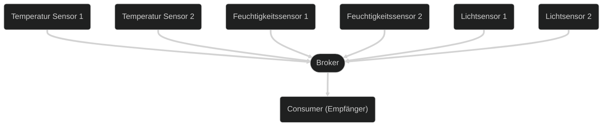

## Was ist Message Queuing Telemetry Transport (MQTT)?

Message Queuing Telemetry Transport (MQTT) ist ein offenes Netzwerkprotokoll,
welches für die Kommunikation von Telemetrie-Daten zwischen Geräten entwickelt
wurde ([Machine-to-Machine](https://de.wikipedia.org/wiki/Machine_to_Machine)). Dabei senden viele IoT-Geräte, wie zum Beispiel
Temperatur- oder Feuchtigkeitssensoren, ihre Daten an einen zentralen Broker.
Dieser ermöglicht es, dass Clients sich bei Topics anmelden und so die Daten
der Sensoren empfangen können.

## Zweck

Heutzutage gibt es über 7 Milliarden IoT-Geräte, welche Daten erzeugen.
Damit diese alle gesammelt und verarbeitet werden können braucht es ein
Protokoll dafür. MQTT ist genau dafür entwickelt worden. Es ermöglicht
IoT-Geräten, welche oft nur wenig Rechenleistung haben, ihre Daten an einen
Broker zu senden, welcher die Daten zur weiterverarbeitung Verteilen kann.

## Funktionsweise

MQTT basiert auf dem Publish-Subscribe-Modell, dass heist es gibt die
sogenannten Producer, welche Daten erzeugen und an den Broker senden und die
Consumer, welche die Daten vom Broker empfangen.

Bei MQTT müssen alle Nachrichten immer mit einem Topic versehen werden. Dieses
dient als Identifikation, damit klar ist um welches Thema es sich bei dieser
Nachricht handelt. Ein Topic ist ein String, welcher aus mehreren Ebenen
bestehen kann, diese werden durch das `/` Zeichen getrennt. Dabei muss ein Topic
mindestens ein Zeichen lang sein und ist dabei `Case-Sensitive`.

Da sich ein Konsument für mehrere Themen interessieren kann gibt es ebenfalls
Wildcards, welche in einem Topic verwendet werden können. Diese sind `+` und
`#`. Das `+` Zeichen ersetzt genau ein Level des Topics und das `#` Zeichen
ersetzt 0 oder mehrere Level des Topics, jedoch darf das `#` nur am Ende des
Topics sein.

## Weitere Ressourcen

[MQTT - Wikipedia](https://de.wikipedia.org/wiki/MQTT)  
[MQTT.org](https://mqtt.org/)  
[MQTT 3.1 Spezifikation](https://public.dhe.ibm.com/software/dw/webservices/ws-mqtt/mqtt-v3r1.html)  
