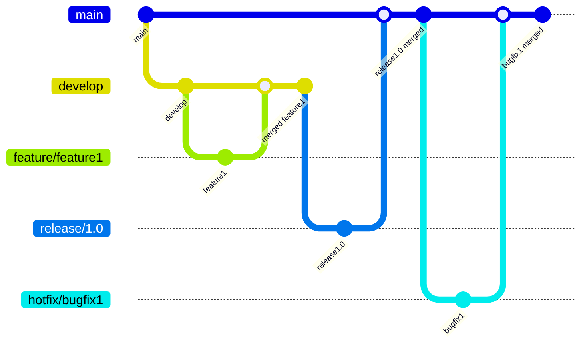
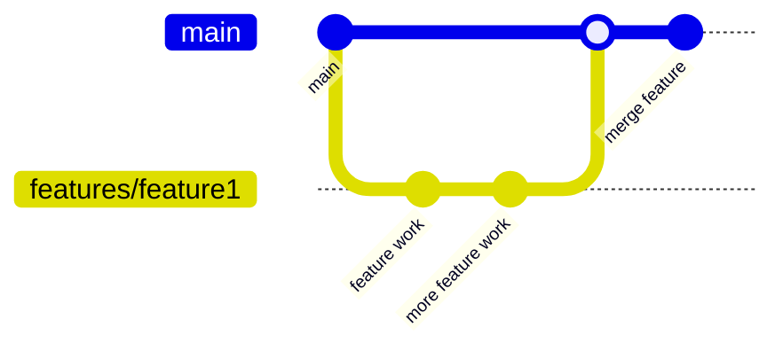

[Git][git] ist eine freie Software zur verteilten Versionsverwaltung von
Dateien, meist Quellcode. Git wurde ursprünglich von [Linus Torvalds][linus]
erstellt um die Entwicklung des Linux-Kernels zu ermöglichen als die Lizenz
des damals verwendeten Versionsverwaltungssystems BitKeeper geändert wurde,
wodurch die Kernel-Entwickler diese nicht mehr frei verwenden konnten.

>I'm an egotistical bastard, and I name all my projects after myself. First
>'Linux', now 'Git'  
> \- *Linus Torvalds*

*('Git' ist ein britischer Slangausdruck für einen dummen oder unangenehmen
Menschen, der immer das Gefühl hat korrekt zu sein)*

Linus Torvalds hatte bei der Entwicklung von Git drei zentrale Ziele:

1. Git sollte eine verteilte nicht-lineare Versionsverwaltung von Software
   ermöglichen.
2. Git sollte eine möglichst starke Datenintegrität gewährleisten um
   unbeabsichtigte oder böswillige Verfälschungen zu stoppen.
3. Git sollte möglichst effizient sein.

## Verwendung von Git

Git verwendet Repositories für die Versionskontrolle. Ein Repository ist eine
vollständige Kopie des Projekts inklusive der Versionsgeschichte. Viele
Entwickler verwenden jedoch noch ein Repository auf einem zentralen Server,
zum Beispiel GitHub, GitLab oder Bitbucket, als `remote` oder `origin`. Dieses
Repository dient als zentrale Anlaufstelle für die Zusammenarbeit und alle
Entwickler können ihre Änderungen in dieses Repository synchronisieren, um eine
bessere Kollaboration zu ermöglichen, ohne dass sich alle Entwickler Änderungen
gegenseitig zusenden müssen.

Ein solches Repository kann entweder neu mit dem `git init` Befehl im aktuellen
Verzeichnis erstellt werden oder ein bestehendes Repository kann mit dem
`git clone` Befehl heruntergeladen werden.

In diesem Repository können nun neue Dateien erstellt oder bestehende Dateien
bearbeitet werden.

{}

Wenn eine Datei aus dem Git Repository gelöscht wird, wird diese nicht aus der
Versionsgeschichte entfernt, dies ist wichtig damit vorherige Versionen
wiederhergestellt werden können. Wurde jedoch eine Datei mit vertraulichen
Daten in das Repository aufgenommen heisst dies dass diese explizit aus der
gesamten Versionsgeschichte entfernt werden muss, wodurch sich die ganze
Geschichte verändert.

Dies kann vor allem bei Diensten wie GitHub ein Problem sein, da es dort möglich
ist Dateien mithilfe deren Commit Hashes aufzurufen, auch wenn diese nicht mehr
in der Versionsgeschichte vorhanden sind und müssen direkt durch GitHub entfernt
werden.

{}

Sobald Änderungen am Repository gemacht wurden und diese nun in die
Versionsgeschichte aufgenommen werden sollen kann mithilfe des `git status`
Befehls überprüft werden, welche Änderungen am Repository existieren.
Mit dem `git add <Datei>` Befehl können dann die Änderungen spezifiziert werden
welche mit dem nächsten Commit in die Versionsgeschichte aufgenommen werden
sollen. Der `git commit` Befehl erstellt dann diesen neuen Commit in der
Versionsgeschichte. Der `git commit` Befehl benötigt das `--message` oder `-m`
Argument mit welchem eine Commit Nachricht angegeben werden muss, hier kann es
Sinn machen eine Konvention wie [Conventional Commits][cc] zu verwenden.

Diese Änderungen können dann mithilfe des `git push origin` Befehls in das
zentrale Repository synchronisiert werden. Andere Entwickler können dann mithilfe
des `git pull origin` Befehls die Änderungen aus dem zentralen Repository
herunterladen.

## Branching und Merging Konventionen

Git ist ein Versionsverwaltungssystem welches nicht-lineare Entwicklung fördert.
Dies ermöglicht es die Entwicklung von mehreren Features oder Bugfixes parallel
zu entwickeln. Dazu verwendet Git Branches ein Branch nimmt dabei den Stand der
Versionsgeschichte eines Commits und erweitert diesen mit weiteren Commits. mit
dem Ziel den Branch dann wieder in den Hauptbranch zu integrieren.

Hierbei gibt es vor allem zwei Modelle wie Branches verwendet werden können.
Einerseits das umfangreichere Git-Flow Modell und andererseits das einfachere
GitHub-Flow Modell.

### Git-Flow

Git-Flow ist ein beliebtes Branching-Modell, welches eine klare Strukturierung
des Repositories ermöglicht. Es besteht aus zwei Haupt-Branches und mehreren
Support-Branches.

**Main Branches**:
- `main`: Der Hauptbranch, welcher immer stabilen Code enthält (früher `master`)
- `develop`: Der Entwicklungsbranch, welcher neue Features sammelt.

**Supporting Branches**:
- `feature/*`: Branches für neue Features
- `release/*`: Branches für die Vorbereitung eines neuen Releases.
- `hotfix/*`: Branches für die Behebung von kritischen Fehlern.

### GitHub-Flow

GitHub-Flow ist ein einfacheres Branching-Modell, welches vor allem für kleinere
Projekte oder Teams geeignet ist. Es besteht aus einem Haupt-Branch und
feature-Branches. Anstatt das neue Features in einem `develop` Branch gesammelt
werden diese direkt in den Haupt-Branch integriert.

## Branching und Merging mit Git

Ein Grundkonzept von Git ist es, dass es eine nicht-lineare Entwicklung
ermöglicht. Wie davon Gebrauch gemacht werden kann ist hier einfach
Dokumentiert. Für ein praktisches Einführen kann ich die
[Learn git Branching][learn-git-branching] Website empfehlen, welche diese
Konzept in einem einfachen Spiel erklärt.

### Branching

Branching erlaubt es, die nicht-linearen Entwicklungsstränge zu erstellen ohne
den Haupt-Branch zu beeinflussen.

- **Neuen Branch erstellen und wechseln**:  
  `git switch -c <branch-name>`
- **Zu einem bestehenden Branch wechseln**:  
  `git switch <branch-name>`
- **Liste aller Branches anzeigen**:  
  `git branch`
- **Branch löschen**:  
  `git branch -d <branch-name>` (Funktioniert nur wenn der Branch gemerged
  wurde)  
  `git branch -D <branch-name>` (Erzwingt das Löschen des Branches)

### Merging

Merging ermöglicht es die Arbeit von zwei Branches zusammenzuführen.

- **Branch in den aktuellen Branch mergen**:  
  `git merge <branch-name>`
- **Merge-Konflikt auflösen**:  
  Bei einem Merge ist es möglich, dass ein Konflikt auftritt, da eine Datei zum
  Beispiel in beiden Branches geändert wurde. In diesem Fall werden die
  widersprüchlichen Stellen in der Datei markiert und müssen bearbeitet werden.
  Danach können diese als gelöst markiert und der merge fortgesetzt werden:  
  `git add <Datei>` (Datei als gelöst markieren)  
  `git merge --continue` (Merge fortsetzen)
- **Merge abbrechen**:  
  `git merge --abort`

### Rebasing

Rebasing ist eine alternative Methode um Branches zusammenzuführen. Im Gegensatz
zu einem Merge werden die beiden Branches nicht kombiniert, sondern wird werden
alle Commits eines Branches, welche nicht auf dem anderen Branch basieren,
diesem angehängt, wodurch eine lineare Versionsgeschichte entsteht.

- **Branch auf einen anderen rebasen**:
  `git rebase <branch-name>`
- **Rebase-Konflikt auflösen**:  
  Bei einem Rebase ist es möglich, dass ein Konflikt auftritt, da eine Datei zum
  Beispiel in beiden Branches geändert wurde. In diesem Fall werden die
  wiedersprüchlichen Stellen in der Datei markiert und müssen bearbeitet werden.
  Danach können diese als gelöst markiert und der rebase fortgesetzt werden:  
  `git add <Datei>` (Datei als gelöst markieren)  
  `git rebase --continue` (Rebase fortsetzen)
- **Rebase abbrechen**:  
  `git rebase --abort`

### Remote-Interaktion

Die Remote-Interaktion ermöglicht es, Änderungen mit entfernten Repositories zu
synchronisieren und gemeinsam an Projekten zu arbeiten.

- **Remote-Repository hinzufügen**:  
  `git remote add <name> <url>`
- **List der Remotes anzeigen**:  
  `git remote -v`
- **Änderungen zu einem Remote pushen**:  
  `git push <remote> <branch-name>`
- **Änderungen zu einem Remote pullen**:  
  `git pull <remote> <brach-name>`
- **Remote-Branch lokal auschecken**:  
  `git switch -t <remote>/<branch-name>`
- **Remote-Branch löschen**:  
  `git push <remote> --delete <branch-name>`

## Ressourcen

[Git][git]  
[Git - Wikipedia][git-wiki]  

[git]: https://git-scm.com/
[git-wiki]: https://de.wikipedia.org/wiki/Git
[linus]: https://de.wikipedia.org/wiki/Linus_Torvalds
[cc]: https://www.conventionalcommits.org
[learn-git-branching]: https://learngitbranching.js.org/
