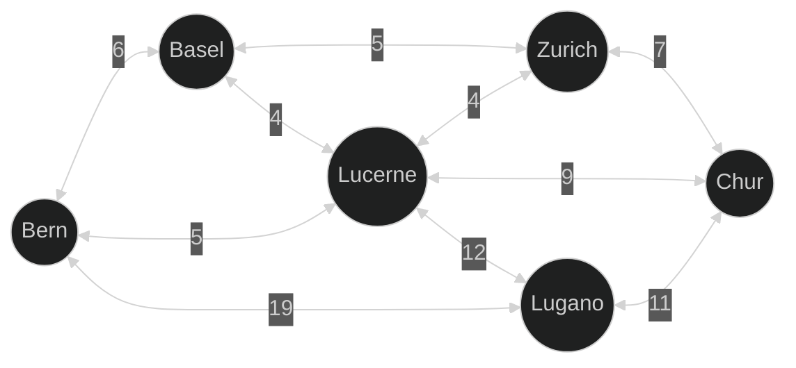
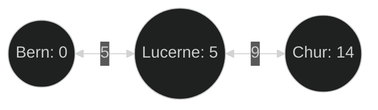

## Introduction

Dijkstra's Algorithm allows to find the cheapest path between nodes in a
weighted graph. The algorithm is named after the Dutch computer scientist and
researcher [Edsger W. Dijkstra][wiki-edsger_w_dijkstra], who developed it in
1956.  
It finds the shortest path from a starting node to all other nodes in the graph.
This can for example be useful when trying to find the shortest path from one
city to another city or in networking to find the fastest connection to another
computer, for example as part of OSPF ([Open Shortest Path First][wiki-ospf]).

## Example

To graphically illustrate the algorithm and simplify understanding, here is an
example:

Given the following graph:



If the goal is to find the shortest path from Bern to Chur, the algorithm must
find out how expensive it is to reach the other nodes from Bern. To do this, you
start with Bern, which has no costs, as you start there, from here all directly
connected nodes can be reached. These then receive the previous costs plus the
costs of the edge over which they are reached as well as the information from
which node they were reached. All newly found nodes are added to a list so that
their connections can be checked. If a node is reached by two different paths,
this node receives the costs which are lower. After all nodes have been checked,
the costs for the node Chur as well as all previous nodes can be read out.

In the above example the fastest path from Bern to Chur is to move through
Lucerne which leads to a cost of 14.



## Functionality

{}
This paragraph is strongly based on the description from Wikipedia:  
[Dijkstr's Algorithm > Algorithm][wiki-dijkstras_algorithm-algorithm]
{}

Dijkstra's Algorithm requires a starting node as well as a target node `N`,
which has a distance to the starting node. The algorithm then starts by assuming
that every node has an infinite distance from the starting node and tries to
improve this.

1. Create a set of all nodes which haven't been visited yet, the unvisited set.
2. Assign each node a distance from the starting node, for the starting node
   this distance is 0, for all other nodes it's infinity, as there is no known
   path to that node yet. During executing these distances will be replace by
   the shortest path found so far.
3. Choose the node with the smallest finite distance from the unvisited set, at
   first this will be the starting node. If the set is empty or no node with a
   finite distance is found the algorithm concludes and continues with step 6.
   If only the path to the target node is of interest, the algorithm can stop
   once the current node is the target node and also jump to step 6.
4. For the current node check each neighboring node, which hasn't been visited
   and update their distance. For this the newly calculated distance through the
   current node needs to be compared with the current distance of the neighbor,
   which needs to receive the smallest distance. For example if the current node
   `A` has a distance of 7 and the edge to the neighbor `B` has a length of 2
   the distance to `B` through `A` would be 9 (7 + 2). Is the current distance
   of `B` larger than 9 it needs to be set to 9 (The path through `A` is
   shorter), else it can be left as is (The path through `A` isn't the
   shortest).
5. After each neighbor of the current node has bee checked mark the current node
   as visited and remove it from the unvisited set. Thus this node will no
   longer be checked, which is correct as the currently saved distance for this
   node is the shortest possible (As ensured by step 3) and therefore final.
6. After finishing the loop (Steps 3-5) all nodes contain the shortest distance
   from the starting node.

## Pseudocode

The following pseudocode is an example of the algorithm which uses a priority
queue to select the node with the shortest distance. The below code also uses
a practical optimisation of the algorithm, by which the nodes don't get
initialized with an infinite distance but instead are added as they are
discovered.

```mermaid
function dijkstra(start, graph) {
  PriorityQueue<Tuple<Number, Node>> queue;

  Map<Node, Number> distances;
  Map<Node, Number> previous;

  distances[start] = 0;
  previous[start] = null;

  queue.push(Tuple(0, start));

  while(!queue.empty()) {
    Number distance, Node current = queue.pop();

    for(Node neighbor in graph.neighbors(current)) {
      Number newDistance = distances + graph.distance(current, neighbor);

      if(!distances.contains(neighbor) || newDistance < distances[neighbor]) {
        distances[neighbor] = newDistance;
        previous[neighbor] = current;
        queue.push(Tuple(newDistance, neighbor));
      }
    }
  }

  return dist, prev;
}
```

## Resources

[Wikipedia - Dijkstr's Algorithm][wiki-dijkstras_algorithm]

[wiki-edsger_w_dijkstra]: https://en.wikipedia.org/wiki/Edsger_W._Dijkstra
[wiki-ospf]: https://en.wikipedia.org/wiki/Open_Shortest_Path_First
[wiki-dijkstras_algorithm]: https://en.wikipedia.org/wiki/Dijkstra%27s_algorithm#:~:text=%5B17%5D-,Algorithm,-%5Bedit%5D
[wiki-dijkstras_algorithm-algorithm]: https://en.wikipedia.org/wiki/Dijkstra%27s_algorithm#:~:text=%5B17%5D-,Algorithm,-%5Bedit%5D
