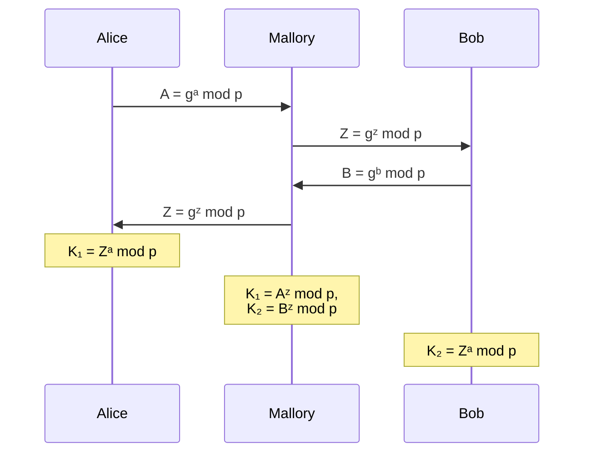

## Introduction

The [Diffie-Hellman key exchange][diffie-hellman-wiki] is a method allowing two
parties to agree on a shared secret key. The method allows for the exchange of the
key to be made over an insecure channel, without the risk of an eavesdropper being
able to receive the same key. This key can then be used for symmetric encryption
in the following communication.

The method was developed in 1976 by Whitfield Diffie and Martin Hellman based on
the mathematical insights found by Ralph Merkle. Do to the importance of the work
of Ralph Merkle, Hellman referred to the method as Diffie-Hellman-Merkle key exchange,
which isn't quite as wide spread.

## Basics

The effectiveness of the Diffie-Hellman method is based on a one-way function.
This is a function that is _"easy"_ to compute but _"hard"_ or even impossible to
invert. In many cryptographic schemes, this one-way function is the discrete exponential
function, also called the modular exponential function.

$$b^e \equiv x \pmod m$$

The inversion of this function is the discrete logarithm, which, for a known base
$b$ and modulus $m$, computes the exponent $e$. However, there is currently no known
method to efficiently compute the discrete logarithm, which makes this calculation
practically impossible for large numbers.

$$\log_b(x) \equiv e \pmod m$$

### Choice of a Generator

In the context of the Diffie-Hellman method, instead of $b$, a generator $g$ is
used. This generator, through repeated application of multiplication modulo $m$,
produces values that are contained in the group ($\mathbb{Z}/n\mathbb{Z}$), where
$n$ is the modulus. This repeated application of multiplication can be represented
by the discrete exponential function:

$$ g \cdot g \ldots g \cdot g \equiv g^x \pmod m $$

This subsection briefly describes why this choice is important.

A group is formed by the pair $(G,*)$ consisting of a set $G$ and an operation $*$,
for which the [associative law][assoziativ-law] holds. Additionally, this group
must contain a neutral element $e$, which satisfies the condition
$e * a = a * e = a$ for all elements $a \in G$. And every element $a \in G$ must
have an inverse element $a^{-1} \in G$, which satisfies the condition
$a * a^{-1} = a^{-1} * a = e$.

An example of such a group is the group of integers with addition as the operation.
Here, $0$ is the neutral element because for every integer $a$, $a + 0 = a$ hold.
And every element $a$ has an inverse element $-a$, because $a + (-a) = 0$ holds.
In the special case where the [commutative law][commutative-law] also holds for
the operation, the group is called an abelian group.

A special type of group is the so-called prime residue class group.
These are defined as the set of all residue classes modulo a prime number $p$
with multiplication as the operation. These groups are denoted by $\mathbb{Z}_p^*$.
It is important to mention that not every value of the residue class modulo $p$
is an element of this group, but only those values for which a multiplicative inverse
exists. This is exactly the case when the value is not $0$ and is coprime to $p$,
which is why a prime number is used as the modulus.

Now, any element $a$ from $\mathbb{Z}\_p^\*$ can be chosen, for which
the set $\lbrace a, a^2, a^3, \ldots, a^{p-1} \pmod p\rbrace$ is considered.
This yields a subgroup of $\mathbb{Z}\_p^\*$ generated by $a$. The set
of elements contained in the subgroup is called the order of the generator.
This order is always a subset of the order of the group, but
not always equal. Choosing a generator with high order is important in cryptographic
systems, as it increases the possible values for the secret key and thus
the security of the system. The following shows the order of the generators
$2$ and $3$ in $\mathbb{Z}\_{13}^\*$, also $\mathbb{F}\_{13}$:



$$
2^1 \equiv 2 \pmod{13} \\\
2^2 \equiv 4 \pmod{13} \\\
2^3 \equiv 8 \pmod{13} \\\
2^4 \equiv 3 \pmod{13} \\\
2^5 \equiv 8 \pmod{13} \\\
2^6 \equiv 12 \pmod{13} \\\
2^7 \equiv 11 \pmod{13} \\\
2^8 \equiv 9 \pmod{13} \\\
2^9 \equiv 5 \pmod{13} \\\
2^{10} \equiv 10 \pmod{13} \\\
2^{11} \equiv 7 \pmod{13} \\\
2^{12} \equiv 1 \pmod{13} \\\
$$

For the generator $2$ the order is $12$ and thus the subgroup contains all
elements of the group $\mathbb{F}\_{13}$.



$$
3^1 \equiv 3 \pmod{13} \\\
3^2 \equiv 9 \pmod{13} \\\
3^3 \equiv 1 \pmod{13} \\\
3^4 \equiv 3 \pmod{13} \\\
3^5 \equiv 9 \pmod{13} \\\
3^6 \equiv 1 \pmod{13} \\\
3^7 \equiv 3 \pmod{13} \\\
3^8 \equiv 9 \pmod{13} \\\
3^9 \equiv 1 \pmod{13} \\\
3^{10} \equiv 3 \pmod{13} \\\
3^{11} \equiv 9 \pmod{13} \\\
3^{12} \equiv 1 \pmod{13} \\\
$$

For the generator $3$ the order is only $3$ and thus the subgroup only contains
the elements $\lbrace 1, 3, 9 \rbrace$ out of the group $\mathbb{F}\_{13}$.



If a generator contains all elements of the group $\mathbb{Z}\_p^\*$, then this
element is a primitive root modulo $p$. In this case, $2$ is a primitive root modulo
$13$, since it contains all elements of the group $\mathbb{F}_{13}$.
A prime number $p$ has exactly $\varphi(p-1)$ primitive roots, where $\varphi$ is
Euler's totient function. This function determines the number of natural numbers
less than $n$ that are coprime to $n$. For the prime number $13$,
$\varphi(12) = 4$, so there are four primitive roots modulo $13$ (namely $2$,
$6$, $7$, and $11$).

Although it has been proven that for every prime $p$ there are $\varphi(p-1)$ primitive
roots, in practice it is difficult to find them, as there is no known algorithm
for efficiently determining them. Thus, it is only possible to choose generators
and then check whether they are primitive roots. This can be checked with the following
condition:

$$
g^{p-1} \equiv 1 \pmod{p}\thickspace\text{and}\thickspace g^i \not\equiv 1
\pmod{p}\thickspace \text{for} \thickspace 2 \leq i \leq p - 2
$$

However, this check is laborious and not practical for large primes as used in cryptograph.
If, however, the prime factorization of $p - 1$ is known, the check can be carried
out much more efficiently, since only the following condition must be satisfied:

$$
g^{\frac{p-1}{p_i}} \not\equiv 1 \pmod{p}\thickspace \text{for all prime factors}
\thickspace p_i \in p
$$

## Functionality







The functioning of the Diffie-Hellman key exchange protocol can be very well illustrated
by mixing colors. Here, the colors symbolize the numbers used, and the mixing of
the colors represents the discrete exponential function.

In this analogy, the one-way function—the mixing of colors—is intuitively recognizable.
It is easy to mix two colors in a container, but it is almost impossible to determine
which two colors were mixed to obtain a particular color.

Alice and Bob first agree on a common color (in this example, yellow), which is
publicly known. Then, both choose a secret color, which they mix with the common
color. They then exchange these mixed colors with each other over the public channel.
If both now mix their secret color into the mixed color received from the other,
they both obtain the same color, which is known only to them. For Eve, who eavesdrops
on the public channel, it is not possible to determine the secret color, since she
only knows the original common color and the mixed colors.



### Mathematical Representation

In digital communication over an insecure channel, such as the Internet, encryption
must be used for secure communication. However, it can also make sense to consider
any channel as insecure. This communication is usually encrypted symmetrically,
since symmetric encryption is much faster than asymmetric encryption. However, a
shared secret key is required for such encryption. The Diffie-Hellman method is
used for the secure exchange of this key.

1. Alice and Bob first **publicly** agree on a prime number $p$ and a generator
   $g$. These two values are usually specified by different standards, but can also
   be chosen by the parties themselves.  
   These two values are not secret for the security of the procedure and can be
   exchanged over an insecure channel without concern.
2. Alice and Bob each generate a secret random number (private key) $a$ and $b$
   from the set $\lbrace 1, \ldots, p - 1 \rbrace$. These two numbers are crucial
   for the security of the procedure and **must** be kept secret. They must not
   be known to an eavesdropper like Eve or to the other party.
3. Alice now computes her public key $A \equiv g^a \pmod p$ and sends $A$ over the
   public channel to Bob.  
   Bob now computes his public key $B \equiv g^b \pmod p$ and sends $B$ over the public channel to Alice.
4. Alice receives the public key $B$ from Bob and uses it together with her private
   key $a$ to compute the shared secret key $K_1 \equiv B^a \pmod p$.  
   Bob receives the public key $A$ from Alice and uses it together with his private
   key $b$ to compute the shared secret key $K_2 \equiv A^b \pmod p$.  
   Both now have the same secret key $K$, since $K_1 = K_2$

After this exchange, only Alice and Bob know the shared secret key, since it is
not possible to compute $K$ from the public values $p$, $g$, $A$, and $B$. This
holds as long as the discrete logarithm problem for large numbers remains practically
unsolvable.

The proof, that both parties actually receive the same secret key is provided
using the following equations:

$$
K_1 = B^a \mod{p} = (g^b \mod{p})^a \mod{p} = g^{ba} \mod{p} \\\
K_2 = A^b \mod{p} = (g^a \mod{p})^b \mod{p} = g^{ab} \mod{p}
$$

As multiplication is commutative, it follows that:

$$
g^{ba} \mod{p} = g^{ab} \mod{p}
$$

which leads to:

$$
K_1 = K_2
$$

## Programming

The implementation of the DHM key exchange as Code is quite simple, as long as
the required functions are supported by the programming language or a library.

{}

For the choice of the parameters $p$ and $g$ there are various standards, one
of them is the [RFC 7919][rfc7919], which includes a collection of group
parameters.  
Alternatively, the parameters can also be chosen by the parties themselves.

{}



from random import randint

# Definition of group parameters

## ffdhe2048
## p = 2^2048 - 2^1984 + {[2^1918 * e] + 560316 } * 2^64 - 1
p = 0xFFFFFFFFFFFFFFFFADF85458A2BB4A9AAFDC5620273D3CF1D8B9C583CE2D3695A9E13641146433FBCC939DCE249B3EF97D2FE363630C75D8F681B202AEC4617AD3DF1ED5D5FD65612433F51F5F066ED0856365553DED1AF3B557135E7F57C935984F0C70E0E68B77E2A689DAF3EFE8721DF158A136ADE73530ACCA4F483A797ABC0AB182B324FB61D108A94BB2C8E3FBB96ADAB760D7F4681D4F42A3DE394DF4AE56EDE76372BB190B07A7C8EE0A6D709E02FCE1CDF7E2ECC03404CD28342F619172FE9CE98583FF8E4F1232EEF28183C3FE3B1B4C6FAD733BB5FCBC2EC22005C58EF1837D1683B2C6F34A26C1B2EFFA886B423861285C97FFFFFFFFFFFFFFFF
g = 2

# Key generation
## Alice's key part
a = randint(1, p - 1)  # Alice's private key
A = pow(g, a, p)  # Alice's public key

print("Alice's public key:", hex(A))

## Bob's key part
b = randint(1, p - 1)  # Bob's private key
B = pow(g, b, p)  # Bob's public key

print("Bob's public key:", hex(B))

# Echange of public keys

# Shared secret calculation
## Alice calculates the shared secret
K_1 = pow(B, a, p)  # Alice's shared secret

## Bob calculates the shared secret
K_2 = pow(A, b, p)  # Bob's shared secret

print(f"Alice's shared key: {hex(K_1)}")
print(f"Bob's shared key: {hex(K_2)}")



### Arbitrary Precision Integers

For implementing the DHM method within a program, the current 64-bit (or, depending
on the computer, 128-bit) processor registers are not sufficient to store numbers
required for a secure application of the DHM method. This means a specialized number
type is needed that can store *arbitrarily* large integers. Certain programming
languages, such as JavaScript or Python, offer such types directly; for other language,
a library providing this functionality must be used, for example the free
[GNU Multiple Precision Arithmetic Library (GMP)][gmp].

### Fast modular exponentiation

Additionally, the DHM method requires an algorithm for efficient computation of
the discrete exponential function. This is especially important because, for secure
use of the method, gigantic exponents are used, which would make it practically
impossible to compute the result within a reasonable time frame using a naive algorith,
such as repeated multiplication. Many programming languages or libraries therefore
implement, for example, the [binary exponentiation][binary-exponentiation] algorithm
or [Montgomery arithmetic][montgomery-arithmetic].

## Security

The security of the Diffie-Hellman key exchange method is based on different
factors. The most important factors are listed and explained in this chapter.

### Diffie-Hellman Problem

The Diffie-Hellman problem is the basis for ensuring that an eavesdropper cannot
obtain the shared secret key. It consists of two subproblems.

#### Computational Diffie-Hellman Problem (CDH)

Suppose the eavesdropper Eve learns the numbers $p$, $g$, $A$, and $B$ over the
insecure channel. Is it possible for Eve to determine the shared secret key $K$
or the non-transmitted numbers $a$ or $b$, which would make it trivial to compute
$K$? The problem can be stated as follows:

> Given an element $g$ of a group and the values $A \equiv g^a \pmod p$ and
> $B \equiv g^b \pmod p$, what is the value of $K \equiv g^{ab} \pmod p$,
> with $a$, $b$ unknown?

When very large numbers are chosen for $p$, $a$, and $b$—in modern systems, more
than 1024 bits—no solution to this problem is currently known.

This problem is very closely related to the discrete logarithm problem, because
as soon as the discrete logarithm can be efficiently computed, it becomes trivial
to determine $a$ and $b$ from $g$, $p$, and $A$ or $B$, and thus also solve the
CDH problem. However, it has not yet been proven that this is actually the only
way to solve the CDH problem.

#### Decisional Diffie-Hellman Problem (DDH)

If it is impossible for an attacker to gain any information about the shared secret
key from the publicly known information (CDH), then it must also be impossible for
them to solve the Decisional Diffie-Hellman (DDH) problem. This problem can be formulated
as follows:

> An attacker receives three numbers $A \equiv g^a \pmod p$,
> $B \equiv g^b \pmod p$ and $C \equiv g^c \pmod p$. Here, either $a$, $b$, and
> $c$ are chosen randomly and uniformly from the set
> $\lbrace 1, \ldots, p - 2 \rbrace$, or $c \equiv ab \pmod p$ is set. In the second
> case, $(A, B, C)$ is called a Diffie-Hellman triple. The attacker must now decide
> whether the three numbers form such a triple or not. If they cannot, it is impossible
> for them to infer $g^{ab}$ from $g^a$ and $g^b$.

The problem is therefore to decide, for the given values $g^a$, $g^b$, and $g^c$,
whether $g^{ab} = g^c$ is true.

### Choice of public parameters

#### DHM Prime Number $p$

The security of the DHM method strongly depends on the length of the chosen number.
In particular, the choice of the prime number $p$ is relevant to ensure this length.
Currently, it is recommended to use a prime number $p$ with a length of at least
2048 bits.  
Additionally, there are certain factors that can greatly simplify the computation
of the discrete logarithm. For example, it must be avoided that $p - 1$ contains
only small prime factors, in order to prevent the
[Pohlig-Hellman algorithm][pohling-hellman-algorithm] from being applied. Furthermore,
$p$ should be as unsuitable as possible for the [number field sieve][Zahlkörpersieb].

#### Generator $g$

Besides the choice of the prime number $p$, the choice of the generator $g$ in the
group $Z\_p^\*$ is also very important, since a poor choice of generator can drastically
reduce the order of the subgroup and thus the security of the method. Therefore,
the generator $g$ should be chosen so that all elements of the group $Z\_p^\*$ are
included. Depending on the situation, choosing $g$ as a primitive root can, however,
also reduce the security of the method, as this can make the DDH problem easier
to attack.

#### Use of Fixed Parameters

Since generating secure prime numbers and good generators is computationally intensiv,
many systems choose their parameters from a publicly known list of *good*
parameters.  
As is almost always the case in cryptography, it is important to question the motivation
of the publishers and thus the security of the parameters. More important, however,
is that publicly known parameters allow attackers to perform a large part of the
computationally intensive calculations in advance. For example, after just a week
of preparation, it is possible to break a 512-bit DHM key exchange in about a minute.

### Man-in-the-Middle Attack

The DHM method ensures the secure exchange of a shared secret key, but **not** the
authenticity of the parties. Thus, it is easy for an attacker, Mallory, who can
actively intervene in the process, to eavesdrop on the communication. To do this,
Mallory replaces the public keys from Alice and Bob with her own public key, so
that Alice and Bob each perform a DHM key exchange with Mallory.

After the key exchange, Alice and Bob each possess two different keys, $K_1$ and
$K_2$. However, they assume that they both have the same key and now encrypt their
communication with this key. Mallory, who is in possession of both keys, can now
decrypt, eavesdrop on, manipulate, and re-encrypt the communication before forwarding
it to the respective recipient. As a result, they do not notice the attack.

To prevent such an attack, the exchanged messages must be authenticated. This can
be achieved through various digital signature algorithms. However, this authentication
requires an information advantage, as both parties must ensure in advance that the
signature actually belongs to the real person and has not also been forged by Mallory.

### Side-Channel Attacks

Another way to attack the method is through so-called side-channel attacks. These
refer to cryptanalytic methods that do not target the method itself, but rather
the actual implementation. The goal is to obtain information about the secret key
based on side effects of the implementation.  
For example, it is possible to determine the secret key based on the time required
to compute the discrete exponential function. This is possible because many implementations
of the discrete exponential function use the square-and-multiply algorithm, which
performs different operations depending on the bit of the key being processed, each
requiring a different amount of time.

## Resources

[Diffie-Hellman key exchange - Wikipedia][diffie-hellman-wiki]  
[RFC 7919 - Groups for Authenticated Key Exchange][rfc7919]

[diffie-hellman-wiki]: https://en.wikipedia.org/wiki/Diffie%E2%80%93Hellman_key_exchange
[assoziativ-law]: https://en.wikipedia.org/wiki/Associative_property
[commutative-law]: https://en.wikipedia.org/wiki/Commutative_property
[rfc7919]: https://datatracker.ietf.org/doc/html/rfc7919
[gmp]: https://gmplib.org/
[binary-exponentiation]: https://en.wikipedia.org/wiki/Exponentiation_by_squaring
[montgomery-arithmetic]: https://en.wikipedia.org/wiki/Montgomery_modular_multiplication
[pohling-hellman-algorithm]: https://en.wikipedia.org/wiki/Pohlig%E2%80%93Hellman_algorithm
[zahlkörpersieb]: https://en.wikipedia.org/wiki/General_number_field_sieve
