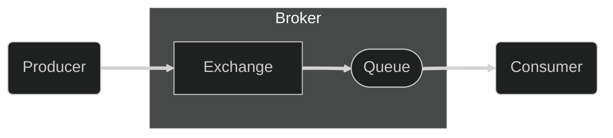
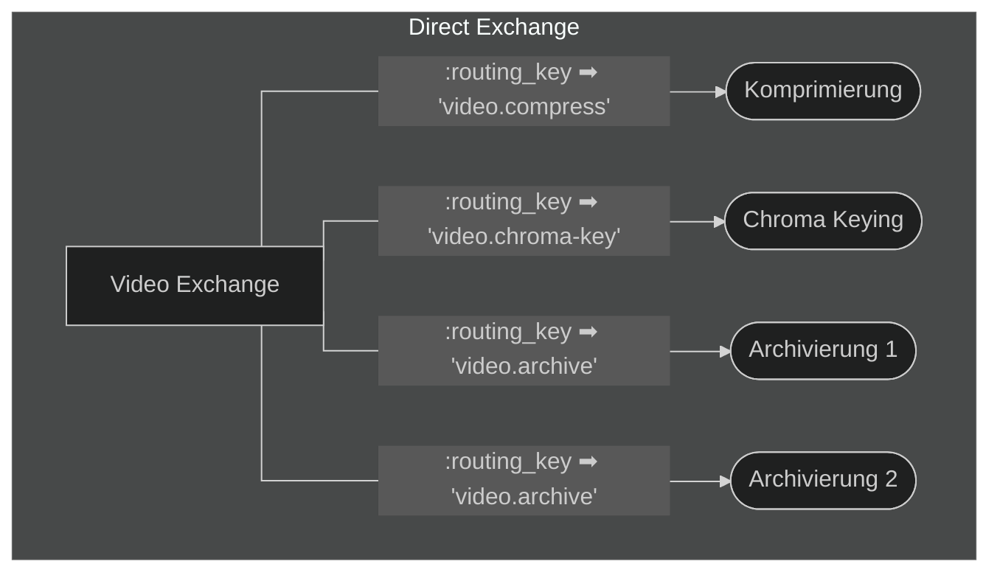
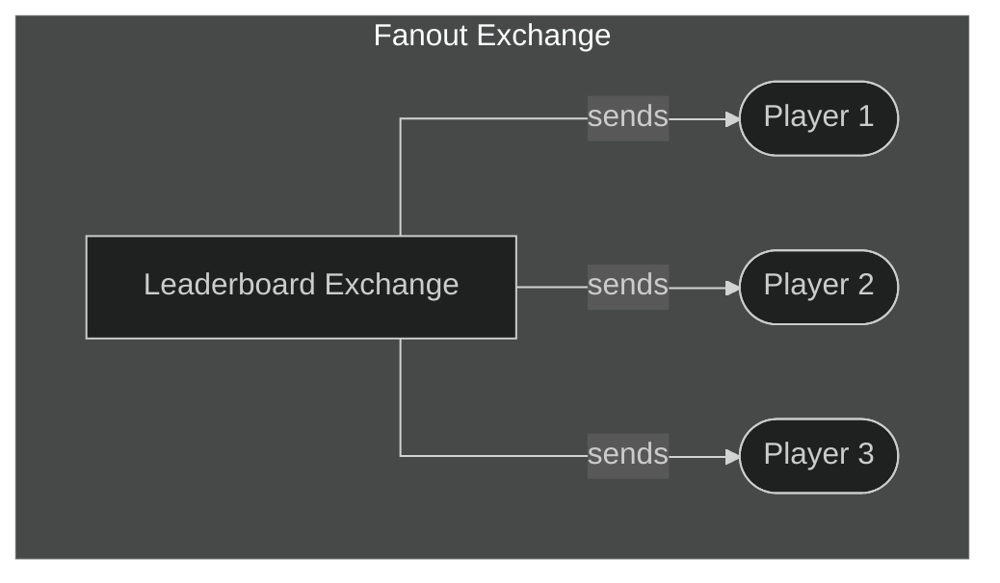

## What is the Advanced Message Queuing Protocol (AMQP)?

The Advanced Message Queuing Protocol (AMQP) is an open standard for
message-oriented middleware. AMQP defines a message format, which can be used by
Client to send messages to a broker. This broker appends the message to a queue,
from where can be consumed and processed by another client.

## Purpose

AMQP allows the communication between different systems over a central broker.
As such AMQP is used to create distributed systems. AMQP allows all systems
which implement the standard to communicate with each other, which allows for
their independent development and deployment. This is especially useful for
creating systems which are easier to maintain and extend as well as making the
system more scalable.

## How it works

AMQP is a network protocol based on the TCP/IP stack. It defines three
participants, the producer, the broker, and the consumer. The producer creates
data and sends them in form of messages to the broker. The broker accepts these
messages through an exchange, which defines into which queue the message should
be passed. The consumer can then retrieve the messages from the queue of the
broker and process them. This process roughly looks like this:

The producer adds certain attributes to the messages which are sent to the
exchange. Based on the exchange type and the specific attributes set in the
message the message then gets sent to zero or more queues. Which then send them
to subscribed consumers.

It is important to say that AMQP is a programmable protocol, meaning that the 
queues and exchanges don't need to be defined ahead of time, instead they can be
created and configured at runtime by the clients. This allows the developers to
use their application to create all the necessary queues and exchanges for the
application.

### Broker

The broker ist the central component of AMQP. IT is responsible for the
distribution of messages. Any client which is part of the AMQP network needs to
register themselves with the broker, which then allows them to publish messages
to the exchanges or consume messages from the queues.

### Exchange

Exchanges in AMQP are entities, which receive the messages from the producers
and then pass them on to zero or more queues. The rules by which the messages
are forwarded to the queues is based on the type of exchange and it's bindings.
The AMQP 0-9-1 standard defines four different exchange types, but
implementations of the AMQP standard may define additional exchange types.
The process of forwarding a message to one or more queues works by copying the
message so that each queue gets it's own copy of the message which needs to be
treated as unique.



| Exchange Typ     | Name des vordefinierten Exchanges     |
| :--------------- | :------------------------------------ |
| Direct exchange  | `""` (empty string) and `amq.direct` |
| Fanout exchange  | `amq.fanout`                          |
| Topic exchange   | `amq.topic`                           |
| Headers exchange | `amq.match`                           |



An instance of an exchange consists of the following attributes:

- **Name**: The name of the exchange, by which it is identified.
- **Type**: The type of the exchange, which defines how the messages are
  forwarded.
- **Durability**: Whether the exchange should be persisted to disk and survive
  a system restart or not.
- **Auto-delete**: Whether the exchange should be deleted when the last queue
  is unbound from it.
- **Arguments (optional)**: Additional arguments which may be used by plugins or
  broker specific features.

#### Default / Nameless Exchange

The nameless exchange is a special exchange defined in the AMQP specification.
It works like a direct exchange, but doesn't have a name (`""`). Every queue
needs to be automatically bound to this exchange with the binding key being the
name of the queue. This allows the producers to send messages to any queue by
sending them to the nameless exchange and using the queue name as routing key.

#### Direct Exchange

The direct exchange is a simple exchange type, which forwards messages based on
their routing key. A message is routed if the routing key `K` matches the
binding key `B` of the queue. For any message where `K == B` is true the message
will be routed to the appropriate queue.  
All brokers need to define at least one direct exchange with the name 
`amqp.direct` out of the box.  
A direct exchange is especially suited for [Unicast](https://de.wikipedia.org/wiki/Unicast) messages, but could also be
used for [Multicast](https://de.wikipedia.org/wiki/Multicast) messages.

It works like this:

- A queue binds itself to the exchange using the binding key `B`.
- A producer sends a message to the exchange using the routing key `K`.
- The message gets routed to the queue if `K == B`.

Visualized as a graph it looks something like this:

#### Fanout Exchange

The fanout exchange forwards all messages unconditionally to all queues which
are bound to it. Meaning the routing key is ignored.  
All brokers need to define at least one fanout exchange with the name
`amq.fanout` out of the box.  
A fanout exchange is most useful for the [Broadcast](https://de.wikipedia.org/wiki/Broadcast) of messages. Where all
consumers need to be informed of all messages.

It works like this:

- A queue binds itself to the exchange.
- A producer sends a message to the exchange.
- The message gets forwarded to all queues bound to the exchange.

Visualized as a graph it looks something like this:

#### Topic Exchange

The topic exchange forwards messages based on a specified pattern. This allows
for the distribution of messages in a [Publish/Subscribe](https://de.wikipedia.org/wiki/Publish/Subscribe) like way, as done by
[MQTT](https://de.wikipedia.org/wiki/MQTT). This enables the creation of a simple [Multicast](https://de.wikipedia.org/wiki/Multicast), where consumers can
select which messages they want to receive.  
This exchange should be implemented by brokers, but it is not required by the
specification. If it is implemented it must create a default topic exchange with
name `amq.topic` out of the box.  

The topic of a routing key consists of zero or more word, which are separated by
a dot (`.`). The individual words may consist of the letters `A-Z`, `a-z`, as
well as the digits `0-9`.  
A binding key follows the same schema as the routing key, but may use the
asterisk (`*`) to replace any one word and the hashtag (`#`) to replace zero or
more words.

Here an example of the pattern matching:

**Routing Key**: `home.firstFloor.bedroom.temperature`  

- `home.firstFloor.bedroom.temperature` ➡ Match
- `home.firstFloor.*.temperature` ➡ Match
- `*.bedroom.temperature` ➡ No Match (The `*` only substitutes one word)
- `home.firstFloor.#` ➡ Match
- `home.firstFloor.bedrrom.temperature.#` ➡ Match

It works like this:

- A queue binds itself to the exchange using a binding pattern `P`.
- A producer sends a message to the exchange using the routing key `K`.
- The message is forwarded to the queue if `K` matches the pattern `P`.

#### Headers Exchange

The headers exchange allows for more complex routing criteria. Instead of using
the routing key to determine the destination of a message it uses the
additional header attributes of the message, to determine the target.
A queue binds itself to the exchange using a table of attributes with values and
a message is routed to the queue if the attributes present in the message either
all match or at least on matches the ones of the binding.  
This exchange should be implemented by brokers and if it is there needs to be an
headers exchange with the name `amq.match` out of the box.

As mentioned previously this exchange either makes sure of a complete match or a
partial match, this is determined by the `x-match` attribute of the binding.

- `all`: All attributes of the binding need to match the message.
- `any`: At least one attribute of the binding needs to match the message.

It works like this:

- A queue binds itself to the exchange using a table of arguments, which should
  be checked for the message.
- A producer sends a message to the exchange with a table of arguments.
- The message is forwarded to the queue if all (`x-match=all`) or at least
  one (`x-match=any`) of the attributes match.

### Queues

Message queues are entities which store messages in a [First In, First Out](https://de.wikipedia.org/wiki/First_In,_First_Out)
(FIFO) manner, until they are consumed by a consumer. A queue may have multiple
subscribed consumers, but any message will only be sent to a single consumer
unless there is an error during the transmission or the consumer rejects the
message.

A queue consists the following attributes:

- **Name**: The name of the queue, by which it is identified.
- **Durability**: Whether the queue should be persisted to disk and survive a
  system restart or not.
- **Exclusive**: Whether the queue should only be accessible by the client which
  created it.
- **Auto-delete**: Whether the queue should be deleted when the last consumer
  unsubscribes from it.
- **Arguments (optional)**: Additional arguments which may be used by plugins or
  broker specific features.

#### Queue Names

The name of a queue can be chosen freely by the application. However, any name
beginning with `amq.` is reserved by the AMQP specification and may not be used
by any application. If a queue should be created with a random unique name it
may be created with an empty name (`""`) after which the broker will assign it a
unique name.

### Bindings

A binding is the connection between an exchange and a queue. The binding defines
the rules, by which an exchange defines where to a message should be routed.  
As the basis of routing is dependent on the exchange type, the specifics of the
binding also differ between exchange types.

### Consumer

The consumer is the AMQP entity which retrieves messages from queues. When a
client starts consuming the messages of a queue it creates a consumer for the
clients connection to the broker which then sends the messages asynchronously to
the client.

### Messages

Messages are the entities which transfer data, between the different parts of
the system. A message consists of its header, which contains metadata about the
message as well as the body containing the actual data in form of a binary blob.

It is possible for the broker to persist messages to the disk, which stops them
from being lost in case of a system failure.

## Additional Resources

[Advanced Message Queuing Protocol - Wikipedia](https://de.wikipedia.org/wiki/Advanced_Message_Queuing_Protocol)  
[AMQP Concepts](https://www.rabbitmq.com/tutorials/amqp-concepts)  
[AMQP 0-9-1 Specification](https://www.rabbitmq.com/resources/specs/amqp0-9-1.pdf)
