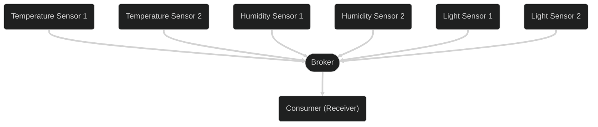

## What is Message Queuing Telemetry Transport (MQTT)?

Message Queuing Telemetry Transport (MQTT) is an open network protocol developed
for the communication of telemetry data between devices ([Machine-to-Machine](https://en.wikipedia.org/wiki/Machine_to_Machine)).
Many IoT devices, such as temperature or humidity sensors, send their data to a
central broker. This broker allows clients to subscribe to topics and receive
the data from the sensors.

## Purpose

Today, there are over 7 billion IoT devices generating data. To collect and
process all this data, a protocol is needed. MQTT was developed precisely for
this purpose. It allows IoT devices, which often have limited computing power,
to send their data to a broker, which can distribute the data for further
processing.

## Functionality

MQTT is based on the publish-subscribe model, meaning there are producers that
generate data and send it to the broker, and consumers that receive the data
from the broker.

In MQTT, all messages must always be tagged with a topic. This serves as an
identification to clarify the subject of the message. A topic is a string that
can consist of multiple levels, separated by the `/` character. A topic must be
at least one character long and is case-sensitive.

Since a consumer can be interested in multiple topics, there are also wildcards
that can be used in a topic. These are `+` and `#`. The `+` character replaces
exactly one level of the topic, and the `#` character replaces 0 or more levels
of the topic, but the `#` can only be at the end of the topic.

## Resources

[MQTT - Wikipedia](https://de.wikipedia.org/wiki/MQTT)  
[MQTT.org](https://mqtt.org/)  
[MQTT 3.1 Spezifikation](https://public.dhe.ibm.com/software/dw/webservices/ws-mqtt/mqtt-v3r1.html)  
