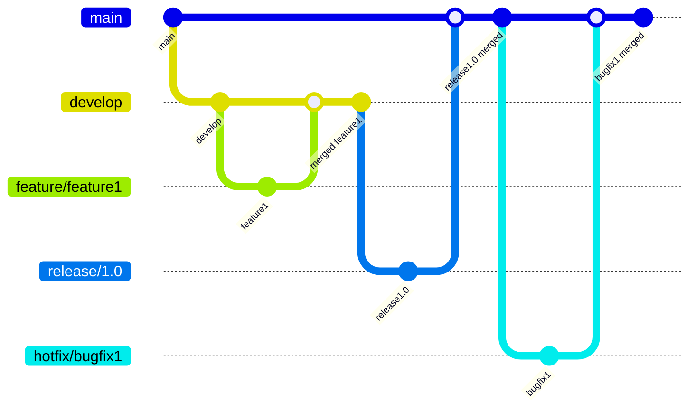
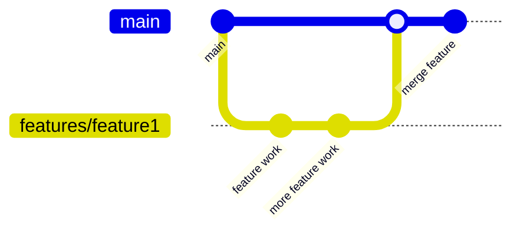

[Git][git] is free software for distributed version control of files, mostly
source code. Git was originally created by [Linus Torvalds][linus] to enable
the development of the Linux kernel when the license of the previously used
version control system BitKeeper was changed, making it no longer freely
usable by kernel developers.

> I'm an egotistical bastard, and I name all my projects after myself. First
> 'Linux', now 'Git'  
> \- *Linus Torvalds*

*('Git' is a British slang term for a stupid or unpleasant person who always
thinks they are right)*

Linus Torvalds had three main goals when developing Git:

1. Git should enable distributed, non-linear version control of software.
2. Git should ensure strong data integrity to prevent accidental or malicious
   tampering.
3. Git should be as efficient as possible.

## Using Git

Git uses repositories for version control. A repository is a complete copy of
the project, including its version history. However, many developers also use
a repository on a central server, such as GitHub, GitLab, or Bitbucket, as a
`remote` or `origin`. This repository serves as a central hub for
collaboration, allowing all developers to synchronize their changes without
having to send changes to each other individually.

Such a repository can either be created anew with the `git init` command in
the current directory or an existing repository can be downloaded using the
`git clone` command.

In this repository, new files can now be created or existing files can be
edited.

{}

If a file is deleted from the Git repository, it is not removed from the
version history. This is important so that previous versions can be restored.
However, if a file with sensitive data has been added to the repository, it
must be explicitly removed from the entire version history, which changes the
entire history.

This can be especially problematic with services like GitHub, as it is
possible to access files using their commit hashes, even if they are no longer
present in the version history, and they must be removed directly by GitHub.

{}

Once changes have been made to the repository and should now be added to the
version history, the `git status` command can be used to check which changes
exist in the repository. The `git add <file>` command can then be used to
specify the changes to be included in the next commit in the version history.
The `git commit` command then creates this new commit in the version history.
The `git commit` command requires the `--message` or `-m` argument, which must
specify a commit message. It may make sense to use a convention like
[Conventional Commits][cc].

These changes can then be synchronized to the central repository using the
`git push origin` command. Other developers can then download the changes from
the central repository using the `git pull origin` command.

## Branching and Merging Conventions

Git is a version control system that promotes non-linear development. This
allows the development of multiple features or bug fixes in parallel. To
achieve this, Git uses branches. A branch takes the state of the version
history of a commit and extends it with further commits, with the goal of
integrating the branch back into the main branch.

There are two main models for using branches: the more extensive Git-Flow
model and the simpler GitHub-Flow model.

### Git-Flow

Git-Flow is a popular branching model that provides a clear structure for
repositories. It consists of two main branches and several support branches.

**Main Branches**:
- `main`: The main branch, which always contains stable code (formerly `master`)
- `develop`: The development branch, which collects new features.

**Supporting Branches**:
- `feature/*`: Branches for new features
- `release/*`: Branches for preparing a new release.
- `hotfix/*`: Branches for fixing critical bugs.

### GitHub-Flow

GitHub-Flow is a simpler branching model, suitable primarily for smaller
projects or teams. It consists of a main branch and feature branches. Instead
of collecting new features in a `develop` branch, they are integrated directly
into the main branch.

## Branching and Merging with Git

A core concept of Git is that it enables non-linear development. How to make
use of this is documented here. For a practical introduction, I recommend the
[Learn git Branching][learn-git-branching] website, which explains this
concept in a simple game.

### Branching

Branching allows you to create non-linear development strands without
affecting the main branch.

- **Create and switch to a new branch**:  
  `git switch -c <branch-name>`
- **Switch to an existing branch**:  
  `git switch <branch-name>`
- **List all branches**:  
  `git branch`
- **Delete a branch**:  
  `git branch -d <branch-name>` (Only works if the branch has been merged)  
  `git branch -D <branch-name>` (Forces branch deletion)

### Merging

Merging allows you to combine the work of two branches.

- **Merge a branch into the current branch**:  
  `git merge <branch-name>`
- **Resolve a merge conflict**:  
  During a merge, a conflict may occur if a file has been changed in both
  branches. In this case, the conflicting sections in the file are marked and
  must be edited. Afterward, they can be marked as resolved, and the merge can
  continue:  
  `git add <file>` (Mark file as resolved)  
  `git merge --continue` (Continue merge)
- **Abort a merge**:  
  `git merge --abort`

### Rebasing

Rebasing is an alternative method for joining the work branches. Unlike a merge,
the two branches are not combined; instead, all commits of a branch that do not
base on the other branch are appended to it, creating a linear version history.

- **Rebase a branch onto another**:  
  `git rebase <branch-name>`
- **Resolve a rebase conflict**:  
  During a rebase, a conflict may occur if a file has been changed in both
  branches. In this case, the conflicting sections in the file are marked and
  must be edited. Afterward, they can be marked as resolved, and the rebase can
  continue:  
  `git add <file>` (Mark file as resolved)  
  `git rebase --continue` (Continue rebase)
- **Abort a rebase**:  
  `git rebase --abort`

### Remote Interaction

Remote interaction allows you to synchronize changes with remote repositories
and collaborate on projects.

- **Add a remote repository**:  
  `git remote add <name> <url>`
- **List remotes**:  
  `git remote -v`
- **Push changes to a remote**:  
  `git push <remote> <branch-name>`
- **Pull changes from a remote**:  
  `git pull <remote> <branch-name>`
- **Checkout a remote branch locally**:  
  `git switch -t <remote>/<branch-name>`
- **Delete a remote branch**:  
  `git push <remote> --delete <branch-name>`

## Resources

[Git][git]  
[Git - Wikipedia][git-wiki]  

[git]: https://git-scm.com/
[git-wiki]: https://en.wikipedia.org/wiki/Git
[linus]: https://en.wikipedia.org/wiki/Linus_Torvalds
[cc]: https://www.conventionalcommits.org
[learn-git-branching]: https://learngitbranching.js.org/
